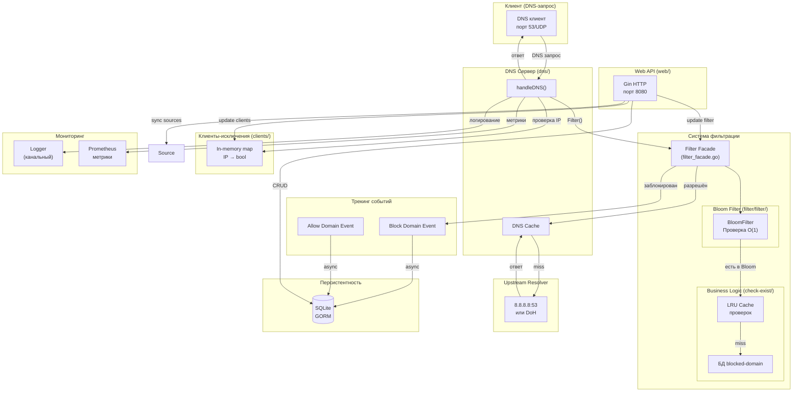
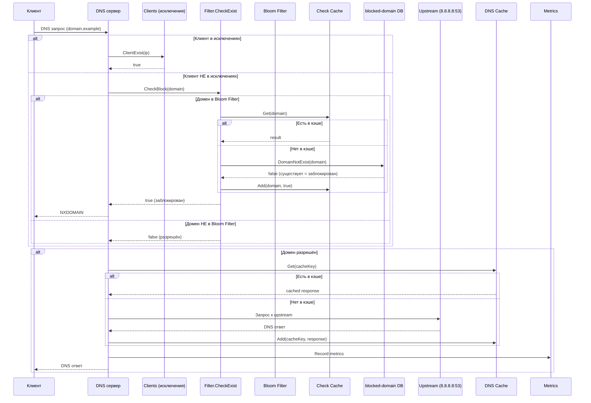

# DNS Filter - Архитектурная документация

## Обзор проекта

DNS Filter — это высокопроизводительный DNS-сервер на Go с функцией фильтрации доменов по черным/белым спискам. Проект использует архитектуру с явным разделением на слои: обработка DNS-запросов, бизнес-логика фильтрации, персистентность и HTTP API.

## Структура проекта

```
dns-filter/
├── main.go                      # Точка входа, инициализация компонентов
├── config/                      # Конфигурация приложения
├── db/                          # Подключение к SQLite (GORM)
├── dns/                         # DNS сервер (miekg/dns)
├── filter/                      # Логика фильтрации
│   ├── filter/                  # Bloom filter
│   ├── cache/                   # Кэш проверок доменов
│   └── business/               # Use cases фильтрации
├── blocked-domain/              # Черный список доменов
│   ├── db/                      # Работа с БД
│   ├── business/                # Use cases
│   └── web/                     # HTTP обработчики
├── allow-domain/                # Белый список доменов
├── clients/                     # Исключения по IP-клиентам
├── source/                      # Синхронизация списков из внешних источников
├── dns-cache/                   # LRU-кэш DNS ответов
├── lru-cache/                   # Базовая реализация LRU
├── logger/                      # Канальный логгер
├── web/                         # HTTP API сервер (Gin)
├── metric/                      # Prometheus метрики
└── suggest-to-block/            # Интеллектуальные предложения
```

## Ключевые компоненты

### 1. DNS Сервер (`dns/`)

**Назначение:** Обработка входящих DNS-запросов на порту 53/UDP.

**Ключевые файлы:**
- `server.go` — основной DNS-сервер

**Зависимости:**
- `logger` — логирование запросов
- `dns-cache` — кэширование ответов upstream
- `filter` — проверка доменов на блокировку
- `metric` — сбор метрик
- `clients` — проверка исключений по IP

**Поток обработки запроса:**
1. Получает DNS-запрос от клиента
2. Извлекает домен из вопроса
3. Проверяет IP клиента в списке исключений (`clients`)
4. Если клиент НЕ в исключениях → вызывает `filter.CheckExist()`
5. Если домен заблокирован → возвращает NXDOMAIN
6. Если разрешён → запрашивает upstream (8.8.8.8:53 по умолчанию)
7. Кэширует ответ в `dns-cache`
8. Возвращает ответ клиенту

### 2. Фильтрация (`filter/`)

**Назначение:** Определение, является ли домен заблокированным.

**Компоненты:**

#### Bloom Filter (`filter/filter/filter.go`)
- Probabilistic data structure для быстрой проверки наличия домена
- Загружается при старте из БД `blocked-domain`
- Параметры: 10 млн элементов, 0.1% ложноположительных

#### Кэш проверок (`filter/cache/cache-block.go`)
- LRU-кэш результатов проверки доменов
- Емкость: 1500 записей
- Избегает повторных запросов к БД

#### Проверка домена (`filter/business/use-cases/check-exist/check-block.go`)
```go
func CheckBlock(domain string) bool {
    // 1. Проверяем включен ли фильтр (config.Enabled)
    // 2. Проверяем Bloom filter
    // 3. Если есть в Bloom → проверяем кэш
    // 4. Если нет в кэши → запрос к БД blocked-domain
}
```

### 3. Черный список (`blocked-domain/`)

**Назначение:** Управление списком заблокированных доменов.

**Модель БД:**
```go
type BlockList struct {
    ID        uint
    Url       string    // домен
    Active    bool      // активен/выключен
    Source    string    // источник (Steven Black, Easy List и т.д.)
    // Связь с событиями блокировки
    BlockedEvents []BlockDomainEvent
}

type BlockDomainEvent struct {
    ID        uint
    DomainId uint      // ссылка на BlockList
    CreatedAt time.Time
}
```

**Операции:**
- `GetAllActiveFilters()` — получить все активные домены
- `DomainNotExist()` — проверить существование домена
- `CreateDomain()` / `UpdateDnsRecord()` — управление записями
- `BatchCreateBlockDomainEvents()` — логирование событий блокировки

### 4. Белый список (`allow-domain/`)

**Назначение:** Отслеживание разрешённых запросов (для анализа).

**Модель БД:** Аналогично `blocked-domain`, но для разрешённых доменов.

### 5. Клиенты-исключения (`clients/`)

**Назначение:** IP-адреса, для которых фильтрация отключена.

**Реализация:** Простой in-memory словарь с синхронизацией RWMutex.

### 6. Синхронизация источников (`source/`)

**Назначение:** Загрузка списков блокировки из внешних источников.

**Поддерживаемые источники:**
- Steven Black's hosts (GitHub)
- Easy List

**Процесс синхронизации:**
1. Загрузка списка доменов из удаленного URL
2. Дедупликация
3. Пакетная вставка в БД `blocked-domain`

### 7. DNS-кэш (`dns-cache/`)

**Назначение:** Кэширование ответов от upstream-резолвера.

**Реализация:**
- LRU-кэш на основе двусвязного списка
- Емкость: 1500 записей
- Метрики: hits, misses, evictions (Prometheus)

### 8. Логирование (`logger/`)

**Назначение:** Централизованное логирование с поддержкой нескольких обработчиков.

**Архитектура:**
- Канальный логгер (async, не блокирует основной поток)
- Интерфейс `Handler` для подключения различных выводов
- Уровни: DEBUG, INFO, WARN, ERROR

**Обработчики:**
- Console (`logger/handlers/console/`)
- Loki (`logger/handlers/loki/`)

### 9. Web API (`web/`)

**Назначение:** HTTP API для управления системой.

**Порт:** 8080

**Эндпоинты:**

| Маршрут | Описание |
|---------|----------|
| `POST /api/dns-records` | Получить список заблокированных доменов |
| `POST /api/dns-records/create` | Добавить домен в блоклист |
| `POST /api/dns-records/update` | Изменить статус домена |
| `GET /api/filter/status` | Получить статус фильтра |
| `POST /api/filter/change-status` | Включить/выключить фильтр |
| `POST /api/events/block/amount` | Количество блокировок |
| `POST /api/events/block/amount-by-group` | Статистика по доменам |
| `POST /api/suggest-to-block` | Предложения для блокировки |
| `POST /api/sources` | Управление источниками |
| `POST /api/exclude-clients` | Управление исключениями клиентов |
| `POST /api/config/logger/*` | Управление логированием |

### 10. Метрики (`metric/`)

**Назначение:** Сбор и экспорт метрик в Prometheus.

**Метрики:**
- `dns_cache_hits_total` — попадания в кэш
- `dns_cache_misses_total` — промахи кэша
- `dns_cache_evictions_total` — вытеснения из кэша
- `dns_cache_size` — текущий размер кэша

### 11. Suggest to Block (`suggest-to-block/`)

**Назначение:** Интеллектуальные предложения для блокировки доменов.

**Алгоритмы:**
- Похожесть доменов (Damerau-Levenshtein)
- Энтропия (Shannon)
- Фильтрация по "плохим словам"

**Запуск:** Каждые 12 часов (cron)

---

## Диаграмма взаимодействия компонентов



---

## Поток обработки DNS-запроса



---

## Конфигурация

Параметры читаются из переменных окружения (или `.env`):

| Переменная | Описание | Значение по умолчанию |
|------------|----------|----------------------|
| `DNS_FILTER_UPSTREAM` | Upstream DNS сервер | `8.8.8.8:53` |
| `DNS_FILTER_DBPATH` | Путь к SQLite | `./filter.sqlite` |
| `DNS_FILTER_LOG_LEVEL` | Уровень логирования | `INFO` |
| `DNS_FILTER_METRIC_ENABLE` | Включить метрики | `false` |
| `DNS_FILTER_METRIC_PORT` | Порт метрик | `2112` |

---

## Зависимости (go.mod)

- `github.com/miekg/dns` — DNS сервер
- `github.com/bits-and-blooms/bloom/v3` — Bloom filter
- `gorm.io/gorm` + `gorm.io/driver/sqlite` — ORM и БД
- `github.com/gin-gonic/gin` — HTTP фреймворк
- `github.com/prometheus/client_golang` — Метрики
- `github.com/joho/godotenv` — .env файлы

---

## Точка входа (main.go)

```go
func main() {
    // 1. Миграция БД
    migrate.Migrate()
    
    // 2. Синхронизация источников
    source.Sync()
    
    // 3. Загрузка фильтра в память
    filter.UpdateFilterFromDb()
    
    // 4. Обновление списка клиентов
    clients.UpdateClients()
    
    // 5. Запуск фоновых задач
    go blocked_domain.ClearOldEvent()
    go allow_domain.ClearOldEvent()
    go suggest_to_block.StartCollectSuggest()
    
    // 6. Создание компонентов
    logger := logger.GetLogger()
    dnsCache := dns_cache.GetCacheWithMetric()
    metric := dns.CreateMetric()
    allowWorker := allow_domain.CreateAllowDomainEventStore(100)
    blockWorker := blocked_domain.CreateBlockDomainEventStore(100)
    
    // 7. Запуск DNS сервера
    s := dns.CreateServer(logger, dnsCache, filter.CheckExist, 
                          metric, Handlers{...})
    s.Serve()
    
    // 8. Запуск Web API
    web.CreateServer()
}
```

---

## Ключевые архитектурные решения

1. **Bloom Filter + LRU Cache + DB** — трёхуровневая проверка:
   - Bloom: O(1) быстрая проверка, возможны ложноположительные
   - LRU Cache: избежание частых запросов к БД
   - DB: точная проверка при положительном результате Bloom

2. **Канальный логгер** — асинхронное логирование не блокирует DNS-запросы

3. **Event-driven архитектура** — события блокировки/разрешения отправляются асинхронно в БД через каналы

4. **In-memory словари** — для Bloom filter и списка исключений клиентов (быстрый доступ без блокировок)

5. **Singleton паттерн** — для фильтра, логгера, кэшей (sync.Once)
