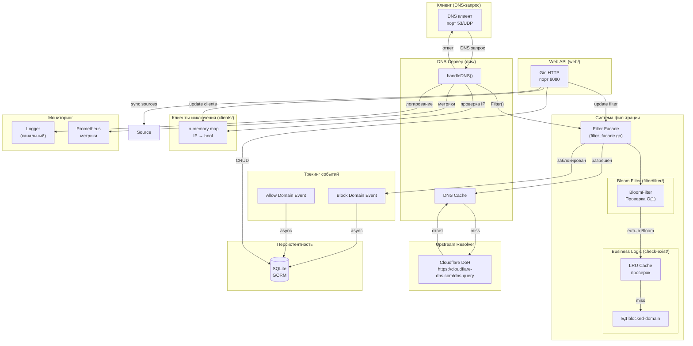
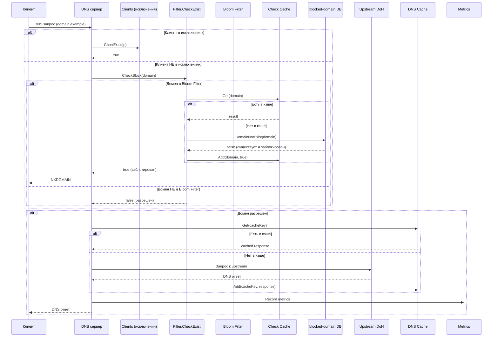

# DNS Filter - Архитектурная документация

## Обзор проекта

DNS Filter — это высокопроизводительный DNS-сервер на Go с функцией фильтрации доменов по черным/белым спискам. Проект использует архитектуру с явным разделением на слои: обработка DNS-запросов, бизнес-логика фильтрации, персистентность и HTTP API.

## Структура проекта

```
dns-filter/
├── main.go                      # Точка входа, инициализация компонентов
├── config/                      # Конфигурация приложения
├── db/                          # Подключение к SQLite (GORM)
├── dns/                         # DNS сервер (miekg/dns)
├── filter/                      # Логика фильтрации
│   ├── filter/                  # Bloom filter
│   ├── cache/                   # Кэш проверок доменов
│   └── business/               # Use cases фильтрации
├── blocked-domain/              # Черный список доменов
│   ├── db/                      # Работа с БД
│   ├── business/                # Use cases
│   └── web/                     # HTTP обработчики
├── allow-domain/                # Белый список доменов
├── clients/                     # Исключения по IP-клиентам
├── source/                      # Синхронизация списков из внешних источников
├── dns-cache/                   # LRU-кэш DNS ответов
├── lru-cache/                   # Базовая реализация LRU
├── logger/                      # Канальный логгер
├── web/                         # HTTP API сервер (Gin)
├── metric/                      # Prometheus метрики
└── suggest-to-block/            # Интеллектуальные предложения
```

## Ключевые компоненты

### 1. DNS Сервер (`dns/`)

**Назначение:** Обработка входящих DNS-запросов на порту 53/UDP.

**Ключевые файлы:**
- `server.go` — основной DNS-сервер

**Зависимости:**
- `logger` — логирование запросов
- `dns-cache` — кэширование ответов upstream
- `filter` — проверка доменов на блокировку
- `metric` — сбор метрик
- `clients` — проверка исключений по IP

**Поток обработки запроса:**
1. Получает DNS-запрос от клиента
2. Извлекает домен из вопроса
3. Проверяет IP клиента в списке исключений (`clients`)
4. Если клиент НЕ в исключениях → вызывает `filter.CheckExist()`
5. Если домен заблокирован → возвращает NXDOMAIN
6. Если разрешён → запрашивает upstream через DNS-over-HTTPS (Cloudflare DoH по умолчанию)
7. Кэширует ответ в `dns-cache`
8. Возвращает ответ клиенту

### 2. Фильтрация (`filter/`)

**Назначение:** Определение, является ли домен заблокированным.

**Компоненты:**

#### Bloom Filter (`filter/filter/filter.go`)
- Probabilistic data structure для быстрой проверки наличия домена
- Загружается при старте из БД `blocked-domain`
- Параметры: 10 млн элементов, 0.1% ложноположительных

#### Кэш проверок (`filter/cache/cache-block.go`)
- LRU-кэш результатов проверки доменов
- Емкость: 1500 записей
- Избегает повторных запросов к БД

#### Проверка домена (`filter/business/use-cases/check-exist/check-block.go`)
```go
func CheckBlock(domain string) bool {
    // 1. Проверяем включен ли фильтр (config.Enabled)
    // 2. Проверяем Bloom filter
    // 3. Если есть в Bloom → проверяем кэш
    // 4. Если нет в кэши → запрос к БД blocked-domain
}
```

### 3. Черный список (`blocked-domain/`)

**Назначение:** Управление списком заблокированных доменов.

**Модель БД:**
```go
type BlockList struct {
    ID        uint
    Url       string    // домен
    Active    bool      // активен/выключен
    Source    string    // источник (Steven Black, Easy List и т.д.)
    // Связь с событиями блокировки
    BlockedEvents []BlockDomainEvent
}

type BlockDomainEvent struct {
    ID        uint
    DomainId uint      // ссылка на BlockList
    CreatedAt time.Time
}
```

**Операции:**
- `GetAllActiveFilters()` — получить все активные домены
- `DomainNotExist()` — проверить существование домена
- `CreateDomain()` / `UpdateDnsRecord()` — управление записями
- `BatchCreateBlockDomainEvents()` — логирование событий блокировки

### 4. Белый список (`allow-domain/`)

**Назначение:** Отслеживание разрешённых запросов (для анализа).

**Модель БД:** Аналогично `blocked-domain`, но для разрешённых доменов.

### 5. Клиенты-исключения (`clients/`)

**Назначение:** IP-адреса, для которых фильтрация отключена.

**Реализация:** Простой in-memory словарь с синхронизацией RWMutex.

### 6. Синхронизация источников (`source/`)

**Назначение:** Загрузка списков блокировки из внешних источников.

**Поддерживаемые источники:**
- Steven Black's hosts (GitHub)
- Easy List

**Процесс синхронизации:**
1. Загрузка списка доменов из удаленного URL
2. Дедупликация
3. Пакетная вставка в БД `blocked-domain`

### 7. DNS-кэш (`dns-cache/`)

**Назначение:** Кэширование ответов от upstream-резолвера с уважением к TTL (RFC 1035 §3.2.1, RFC 2308).

**Реализация:**
- LRU-кэш на основе двусвязного списка (`lru-cache/`)
- Емкость: 1500 записей
- Каждая запись хранит `cachedAt` и `expiresAt`; expiresAt = cachedAt + minTTL
- Положительные ответы: `expiresAt` рассчитывается по минимальному `RR.Ttl` среди секций Answer/Authority/Additional (псевдо-RR OPT игнорируется — поле Ttl у него используется под EDNS flags)
- Отрицательные ответы (NXDOMAIN, NODATA): TTL = `min(SOA.Minttl, SOA.Hdr.Ttl)` (RFC 2308 §5), затем clamp до `DefaultNegativeTTLCap = 300s`, чтобы один сбойный SOA с гигантским minimum не залип на сутки
- Не кэшируются: усечённые ответы (TC=1, RFC 7766 — клиент должен ретраить по TCP), SERVFAIL и прочие Rcode кроме Success/NXDOMAIN, ответы с `TTL=0`, negative-ответы без SOA
- Просроченная запись остаётся в LRU (не удаляется на `Get`) — следующий `Add` обновит слот in-place; удаление на месте порождало бы гонку с параллельным `Add` по тому же ключу
- При попадании в кэш `Get` возвращает свежую копию `*dns.Msg`, у которой `RR.Ttl` уменьшен на время, проведённое в кэше (с floor=1, чтобы downstream-резолвер не интерпретировал 0 как «не кэшируй»)
- Просроченные записи удаляются из LRU при первом обращении к ним
- Метрики: hits, misses, evictions, size, **expired** (Prometheus)

**Singleflight (coalescing к upstream).** При промахе кэша поход в upstream идёт через `singleflight.Group` с ключом `name+qtype` (`dns/singleflight.go`). Если N клиентов одновременно запросили один и тот же домен на холодном кэше, делается ровно один HTTP-запрос к DoH, остальные ждут его результат — это устраняет thundering herd при холодном старте и при истечении TTL у популярных доменов. Внутри fn перед походом в upstream выполняется повторная проверка кэша (double-check), на случай если предыдущий in-flight вызов только что его заполнил. Результат, отданный нескольким вызывающим, копируется (`msg.Copy()`) перед возвратом, иначе мутация `msg.Id` в разных горутинах вызвала бы гонку. Метрика: `dns_singleflight_coalesced_total` — число запросов, чей upstream-вызов был сшит с уже летящим.

**Stale-while-revalidate (RFC 8767).** Поверх обычного TTL у каждой записи есть `staleUntil = expiresAt + CacheStaleGrace` (по умолчанию +24h, только для положительных ответов; NXDOMAIN/NODATA имеют `staleUntil = expiresAt`). `Lookup(key)` возвращает одно из четырёх состояний — `Fresh`, `Stale`, `Expired`, `Miss`. На `Stale`-хит сервер ведёт себя по двум сценариям:

- **Proactive SWR (`DNS_FILTER_CACHE_SWR=true`, дефолт).** Клиент моментально получает stale-ответ с `RR.Ttl`, клампленным до `CacheStaleTTL` (30s по умолчанию, как рекомендует RFC 8767 §6 — чтобы клиент быстро вернулся за свежим). В фоне `refreshWorker` (`dns/swr.go`) запускает рефреш через тот же singleflight, что и hot path: если в этот момент кто-то делает реальный `Miss`, он подцепится к нашему рефрешу вместо собственного upstream-запроса. Параллельные рефреши ограничены семафором `CacheRefreshConcurrency` (32 по умолчанию); при переполнении новые рефреши дропаются (метрика `dns_swr_refresh_total{result="dropped"}`), а stale продолжает отдаваться — следующий stale-хит попробует ещё раз.
- **SWR off (`DNS_FILTER_CACHE_SWR=false`).** Stale-хит проваливается в синхронный upstream — поведение, как до PR. Stale-запись при этом остаётся в кеше и используется как fallback в serve-stale-on-error.

**Serve-stale-on-error (всегда включён, пока `CacheStaleGrace > 0`).** Если синхронный upstream-вызов упал (сеть, таймаут DoH), сервер делает повторный `Lookup`: при наличии `Stale` он возвращается клиенту с метрикой `dns_serve_stale_on_error_total` — это поведение из RFC 8767, дающее устойчивость к коротким сбоям Cloudflare без SERVFAIL для пользователей.

Контекст рефреша *не* связан с клиентским — клиент уже получил stale-ответ, отмена его `ctx` не должна гасить рефреш. Refresh использует собственный `context.WithTimeout(Background, 5s)`.

**Ручной сброс кэша (`POST /api/dns-cache/clear`, `dns-cache/web/`).** Оператор может через Settings-страницу или напрямую через API дропнуть все записи разом — нужно, например, после ротации upstream-записи с длинным TTL. Хендлер вызывает `CacheWithMetrics.Clear()`, которая делегирует в LRU и сбрасывает gauge `dns_cache_size`. Счётчик `dns_cache_evictions_total` намеренно **не** инкрементируется: ручной flush — это операторское действие, а не давление LRU; склеивание этих сигналов сломало бы алёрты на «кэш слишком маленький». В ответе возвращается количество удалённых записей, чтобы UI показал `cleared N entries`. Endpoint защищён общим auth-middleware, как и остальной `/api/*`.

### 8. Логирование (`logger/`)

**Назначение:** Централизованное логирование с поддержкой нескольких обработчиков.

**Архитектура:**
- Канальный логгер (async, не блокирует основной поток)
- Интерфейс `Handler` для подключения различных выводов
- Уровни: DEBUG, INFO, WARN, ERROR

**Обработчики:**
- Console (`logger/handlers/console/`)
- Loki (`logger/handlers/loki/`)

### 9. Web API (`web/`)

**Назначение:** HTTP API для управления системой.

**Порт:** 8080

**Эндпоинты:**

| Маршрут | Описание |
|---------|----------|
| `POST /api/dns-records` | Получить список заблокированных доменов |
| `POST /api/dns-records/create` | Добавить домен в блоклист |
| `POST /api/dns-records/update` | Изменить статус домена |
| `GET /api/filter/status` | Получить статус фильтра |
| `POST /api/filter/change-status` | Включить/выключить фильтр |
| `POST /api/events/block/amount` | Количество блокировок |
| `POST /api/events/block/amount-by-group` | Статистика по доменам |
| `POST /api/suggest-to-block` | Предложения для блокировки |
| `POST /api/sources` | Управление источниками |
| `POST /api/exclude-clients` | Управление исключениями клиентов |
| `POST /api/config/logger/*` | Управление логированием |

### 10. Метрики (`metric/`)

**Назначение:** Сбор и экспорт метрик в Prometheus.

**Метрики:**
- `dns_cache_hits_total` — попадания в кэш
- `dns_cache_misses_total` — промахи кэша (включая истёкшие записи)
- `dns_cache_evictions_total` — вытеснения из кэша
- `dns_cache_expired_total` — лукапы, нашедшие истёкшую по TTL запись (подсчитывается отдельно от холодных промахов: показывает, как часто upstream возвращает короткие TTL)
- `dns_cache_size` — текущий размер кэша
- `dns_cache_stale_hits_total` — лукапы, попавшие в SWR-окно (за TTL, но в пределах `staleUntil`); рост = SWR работает на популярных доменах с истёкшим TTL
- `dns_singleflight_coalesced_total` — запросы, чей upstream-вызов был сшит с уже летящим (защита от thundering herd при холодном кэше)
- `dns_swr_refresh_total{result="ok|error|dropped"}` — фоновые рефреши; `dropped` — семафор был полон, рефреш пропущен (stale всё равно отдаётся)
- `dns_serve_stale_on_error_total` — ответ отдан из stale-окна, потому что upstream упал (RFC 8767)

### 11. Suggest to Block (`suggest-to-block/`)

**Назначение:** Интеллектуальные предложения для блокировки доменов.

**Алгоритмы:**
- Похожесть доменов (Damerau-Levenshtein)
- Энтропия (Shannon)
- Фильтрация по "плохим словам"
- Brand impersonation, homograph, hex/UUID, numeric run, risky TLD

**Запуск:** Каждые 12 часов (cron)

**Auto-block во время Collect.** Каждое предложение пропускается через
`ShouldAutoBlock` (см. `business/use-cases/collect/collect.go`) и
автоматически промоутится в blocklist с `Source = AutoBlocked`, если
выполнено любое из условий:
- `Score >= ThresholdToAutoBlock` (60) — два сильных сигнала
  независимо согласились;
- среди reasons присутствует `CodeSubdomainOfBlocked` — родитель уже
  в blocklist, поддомен почти наверняка из той же семьи (самый
  детерминированный сигнал — bypass score-гейта).

**PSL-guard.** `subdomainAncestors` (см. `buildBlockedIndex`) выбрасывает
из subdomain-сета любой `blocked`, который сам является public suffix
(`golang.org/x/net/publicsuffix`: `ru`, `co.uk`, `xyz`, …). Иначе
поломанное правило источника (например `||ru^$third-party` из RuAdList,
которое парсер EasyList должен был отбросить — см. `IsSafeDNSDomain`) или
ручная ошибка пользователя сделают TLD «родителем» каждого `*.ru` домена
из allow-events, и `ShouldAutoBlock` оптом промоутит весь рунет в
blocklist (инцидент 2026-05-14, 25 авто-блокировок за один прогон).
Защита продублирована: парсер не пускает PSL в `block_lists`, индекс не
доверяет существующим записям.

Остальные предложения (score в `[30, 60)` без subdomain-of-blocked)
по-прежнему уходят в `suggest_blocks` для ручной модерации через
`POST /api/suggest-to-block/add-to-block`. После авто-промоушенов
`Collect()` один раз вызывает `filter.UpdateFilterFromDb()`, чтобы
обновить in-memory bloom без per-domain rebuild. Каждое решение
логируется (`Auto-blocked domain from suggest: ... score: ... reasons: ...`)
— audit trail обязателен, иначе непонятно, почему домен оказался в
blocklist.

---

## Диаграмма взаимодействия компонентов



---

## Поток обработки DNS-запроса



---

## Конфигурация

Параметры читаются из переменных окружения (или `.env`):

| Переменная | Описание | Значение по умолчанию |
|------------|----------|----------------------|
| `DNS_FILTER_DOH_UPSTREAM` | Upstream DoH endpoint | `https://cloudflare-dns.com/dns-query` |
| `DNS_FILTER_DOH_BOOTSTRAP_IPS` | IP-адреса DoH endpoint для подключения без системного DNS | `1.1.1.1,1.0.0.1` |
| `DNS_FILTER_DBPATH` | Путь к SQLite | `./filter.sqlite` |
| `DNS_FILTER_LOG_LEVEL` | Уровень логирования | `INFO` |
| `DNS_FILTER_METRIC_ENABLE` | Включить метрики | `false` |
| `DNS_FILTER_METRIC_PORT` | Порт метрик | `2112` |
| `DNS_FILTER_CACHE_SWR` | Включить proactive stale-while-revalidate (моментально отдаём stale + рефреш в фоне). `false` → stale-хит идёт в синхронный upstream; serve-stale-on-error всё равно работает. | `true` |
| `DNS_FILTER_CACHE_STALE_GRACE` | Окно за `expiresAt`, в течение которого положительная запись считается отдаваемой stale. `0` отключает SWR и serve-stale-on-error полностью. Для NXDOMAIN/NODATA принудительно `0`. | `24h` |
| `DNS_FILTER_CACHE_STALE_TTL` | TTL на RR в stale-ответе клиенту (RFC 8767 §6 рекомендует ≤ 30s). | `30s` |
| `DNS_FILTER_CACHE_REFRESH_CONCURRENCY` | Максимум одновременных фоновых рефрешей; при переполнении новые рефреши дропаются, stale продолжает отдаваться. | `32` |

---

## Зависимости (go.mod)

- `github.com/miekg/dns` — DNS сервер
- `github.com/bits-and-blooms/bloom/v3` — Bloom filter
- `gorm.io/gorm` + `gorm.io/driver/sqlite` — ORM и БД
- `github.com/gin-gonic/gin` — HTTP фреймворк
- `github.com/prometheus/client_golang` — Метрики
- `github.com/joho/godotenv` — .env файлы

---

## Точка входа (main.go)

```go
func main() {
    // 1. Миграция БД
    migrate.Migrate()
    
    // 2. Синхронизация источников
    source.Sync()
    
    // 3. Загрузка фильтра в память
    filter.UpdateFilterFromDb()
    
    // 4. Обновление списка клиентов
    clients.UpdateClients()
    
    // 5. Запуск фоновых задач
    go blocked_domain.ClearOldEvent()
    go allow_domain.ClearOldEvent()
    go suggest_to_block.StartCollectSuggest()
    
    // 6. Создание компонентов
    logger := logger.GetLogger()
    dnsCache := dns_cache.GetCacheWithMetric()
    metric := dns.CreateMetric()
    allowWorker := allow_domain.CreateAllowDomainEventStore(100)
    blockWorker := blocked_domain.CreateBlockDomainEventStore(100)
    
    // 7. Запуск DNS сервера
    s := dns.CreateServer(logger, dnsCache, filter.CheckExist, 
                          metric, Handlers{...})
    s.Serve()
    
    // 8. Запуск Web API
    web.CreateServer()
}
```

---

## Ключевые архитектурные решения

1. **Bloom Filter + LRU Cache + DB** — трёхуровневая проверка:
   - Bloom: O(1) быстрая проверка, возможны ложноположительные
   - LRU Cache: избежание частых запросов к БД
   - DB: точная проверка при положительном результате Bloom

2. **Канальный логгер** — асинхронное логирование не блокирует DNS-запросы

3. **Event-driven архитектура** — события блокировки/разрешения отправляются асинхронно в БД через каналы

4. **In-memory словари** — для Bloom filter и списка исключений клиентов (быстрый доступ без блокировок)

5. **Singleton паттерн** — для фильтра, логгера, кэшей (sync.Once)
