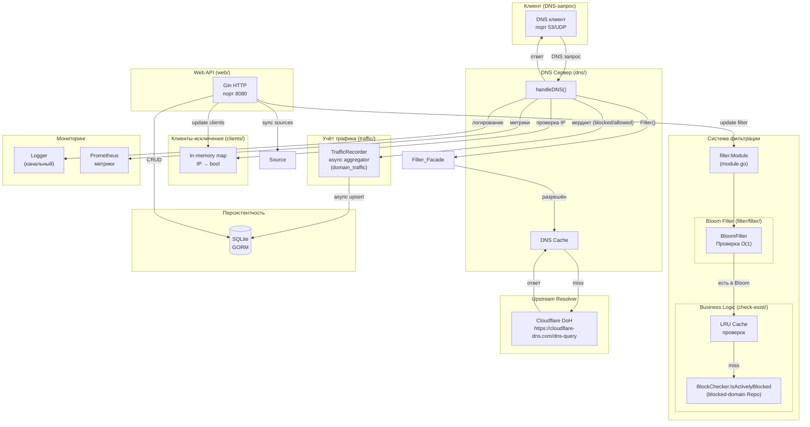
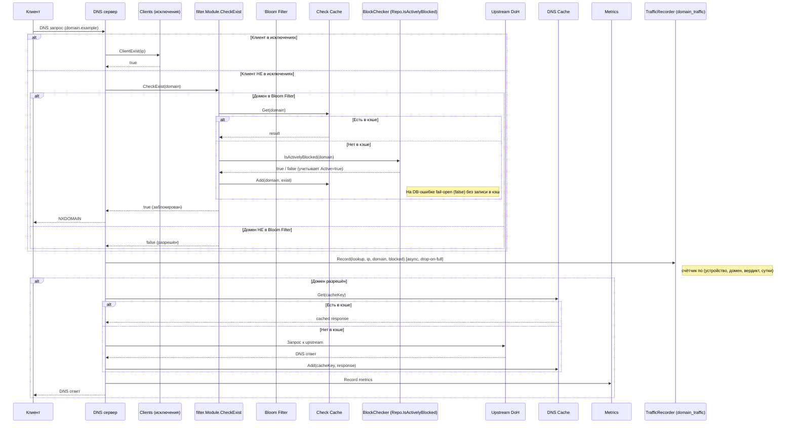

# DNS Filter - Архитектурная документация

## Обзор проекта

DNS Filter — это высокопроизводительный DNS-сервер на Go с функцией фильтрации доменов по черным/белым спискам. Проект использует архитектуру с явным разделением на слои: обработка DNS-запросов, бизнес-логика фильтрации, персистентность и HTTP API.

## Структура проекта

```
dns-filter/
├── main.go                      # Точка входа, инициализация компонентов
├── config/                      # Конфигурация приложения
├── db/                          # Подключение к SQLite (GORM)
├── dns/                         # DNS сервер (miekg/dns)
├── filter/                      # Логика фильтрации
│   ├── filter/                  # Bloom filter
│   ├── cache/                   # Кэш проверок доменов
│   └── business/               # Use cases фильтрации
├── blocked-domain/              # Черный список доменов
│   ├── db/                      # Работа с БД
│   ├── business/                # Use cases
│   └── web/                     # HTTP обработчики
├── traffic/                     # Учёт трафика по устройствам (domain_traffic)
│   ├── db/                      # Модель-счётчик + reads/adapters
│   ├── business/                # Use cases (record, prune)
│   └── web/                     # HTTP обработчики дашборда
├── clients/                     # Исключения по IP-клиентам
├── source/                      # Синхронизация списков из внешних источников
├── dns-cache/                   # LRU-кэш DNS ответов
├── lru-cache/                   # Базовая реализация LRU
├── logger/                      # Канальный логгер
├── web/                         # HTTP API сервер (Gin)
├── metric/                      # Prometheus метрики
└── suggest-to-block/            # Интеллектуальные предложения
```

## Ключевые компоненты

### 1. DNS Сервер (`dns/`)

**Назначение:** Обработка входящих DNS-запросов на порту 53/UDP.

**Ключевые файлы:**
- `server.go` — основной DNS-сервер

**Зависимости:**
- `logger` — логирование запросов
- `dns-cache` — кэширование ответов upstream
- `filter` — проверка доменов на блокировку
- `metric` — сбор метрик
- `clients` — проверка исключений по IP (+ `identifier` для резолва клиента в MAC/IP)
- `traffic` — асинхронная запись счётчика трафика по устройствам (порт `TrafficRecorder`)

**Поток обработки запроса:**
1. Получает DNS-запрос от клиента
2. Один раз на запрос резолвит клиента в `lookup` (`Identifier.Identify` → `{Kind: "mac"|"ip", Value}`); MAC предпочтительнее IP и переживает смену IP по DHCP
3. Извлекает домен из вопроса
4. Проверяет клиента в списке исключений (`clients`, по `lookup`)
5. Если клиент НЕ в исключениях → вызывает `filter.CheckExist()`
6. Пишет вердикт (заблокирован/разрешён) в счётчик `domain_traffic` через `TrafficRecorder` — переиспользуя уже резолвленный `lookup`, неблокирующе, drop-on-full (см. компонент `traffic`)
7. Если домен заблокирован → возвращает NXDOMAIN
8. Если разрешён → запрашивает upstream через DNS-over-HTTPS (Cloudflare DoH по умолчанию)
9. Кэширует ответ в `dns-cache`
10. Возвращает ответ клиенту

### 2. Фильтрация (`filter/`)

**Назначение:** Определение, является ли домен заблокированным.

**Компоненты:**

#### Bloom Filter (`filter/filter/filter.go`)
- Probabilistic data structure для быстрой проверки наличия домена
- Загружается при старте из БД `blocked-domain`
- Параметры: 10 млн элементов, 0.1% ложноположительных

#### Кэш проверок (`filter/cache/cache-block.go`)
- LRU-кэш результатов проверки доменов
- Емкость: 1500 записей
- Избегает повторных запросов к БД

#### Проверка домена (`filter/business/use-cases/check-exist/check-block.go`)
```go
func CheckBlock(deps Deps, domain string) bool {
    // 1. Проверяем включен ли фильтр (deps.Conf.Enabled) и нет ли активной паузы
    // 2. Проверяем Bloom filter (deps.Bloom)
    // 3. Если есть в Bloom → проверяем LRU-кэш (deps.Cache)
    // 4. Если нет в кэше → запрос к БД через deps.Repo (BlockChecker)
    // На любую DB-ошибку — fail-open (false), без записи в кэш
}
```

`filter.Module` (composed in `main.go`) собирает `Deps` один раз и
предоставляет `Module.CheckExist(domain)` для DNS hot path.

### 3. Черный список (`blocked-domain/`)

**Назначение:** Управление списком заблокированных доменов.

**Модель БД:**
```go
type BlockList struct {
    ID        uint
    Url       string    // домен
    Active    bool      // активен/выключен
    Source    string    // источник (Steven Black, Easy List и т.д.)
}
```

**Операции `*blocked-domain/db.Repo`:**
- `GetAllActiveURLs()` — список URL'ов с `Active=true` (используется `filter.Module.UpdateFromDb`)
- `IsActivelyBlocked(domain)` — авторитетная проверка с учётом `Active` (hot path, шаг после bloom-hit + LRU-miss)
- `DomainNotExist(domain)` — для валидации дубля при `CreateDomain`
- `CreateDomain` / `UpdateBlockList` — управление записями
- `CreateDNSRecordsByDomains` / `ChangeRecordStatusBySource` — bulk-операции для `source.Module`

Учёт событий блокировки/разрешения переехал из связанной таблицы
`block_domain_events` в единый счётчик `domain_traffic` (см. компонент
**`traffic`** ниже). Счётчик блокировок (`POST /api/events/block/amount`,
заголовочное число на главной) теперь считается как `SUM(count) WHERE
blocked=true` из `domain_traffic` через `BlockStatsAdapter` — JSON-форма ответа
сохранена. Эндпоинт `/api/events/block/amount-by-group` удалён: статистику
«по доменам» полностью покрывает `GET /api/traffic/top-domains`.

### 4. Трафик по устройствам (`traffic/`)

**Назначение:** Единый счётчик DNS-запросов по устройствам — сколько раз каждое
устройство обращалось к каждому домену, с разбивкой blocked/allowed и по дням.
Таблица `domain_traffic` **заменила** две прежние event-таблицы
(`block_domain_events` + `allow_domain_events`); это счётчик, а не журнал —
по-запросных строк нет.

**Модель БД:**
```go
type DomainTraffic struct {
    ID          uint
    ClientKind  string    // "mac" | "ip" — как опознано устройство
    ClientValue string    // MAC (предпочтительно) или IP — КЛЮЧ устройства
    ClientIP    string    // последний виденный IP — информационно, для UI
    Domain      string    // канонический FQDN
    Blocked     bool      // true = NXDOMAIN, false = форвард в upstream
    Day         time.Time // local-midnight — бакет суток
    Count       int64
    LastSeen    time.Time
    // UNIQUE(client_kind, client_value, blocked, domain, day) — цель аддитивного upsert
}
```

**Личность устройства = MAC, fallback IP.** Запись переиспользует уже
резолвленный на hot-path `lookup` (`dns/server.go` → `Identifier.Identify`):
`Kind: "mac"` когда arpwatcher знает MAC для IP-источника, иначе `Kind: "ip"`.
MAC стабилен при ротации IP по DHCP — поэтому устройство остаётся той же строкой
дашборда. На hot-path ARP-резолв не дёргается повторно. Самозапросы коробки
(пустой/loopback IP-источник) отбрасываются как шум.

**Бакетирование по суткам.** `Day` — время запроса, усечённое до полуночи в
**локальной таймзоне сервера** (`time.Date(y,m,d,…, time.Local)`, НЕ
`time.Truncate(24h)`, которая считает от UTC-эпохи). Усечение делается там, где
строится ключ агрегации (воркер записи).

**Путь записи (async aggregator).** `traffic/business/use-cases/record`
(`TrafficEventStore`) — буферизированный inbox-канал → одна горутина копит
события в RAM-карте по ключу `(kind, value, blocked, domain, day)` (Count++ +
последний IP/LastSeen) и сбрасывает батчем в репо по 20-секундному тикеру или по
достижении capacity (число distinct-ключей). На переполнении канала событие
**дропается** — ответ DNS никогда не ждёт записи в БД. Сброс — аддитивный upsert
(`count = count + excluded.count`, `last_seen = MAX(...)`, `client_ip =
excluded.client_ip`), батчи под лимитом параметров SQLite.

**Чтения.** `traffic/db` обслуживает: дашборд (`DeviceSummary`,
`DomainsForDevice`, `TopDomains`); заголовочный счётчик блокировок (`TotalCount`
через `BlockStatsAdapter`); пул кандидатов suggest
(`GetAllowedDomains` = `DISTINCT domain WHERE blocked=false` через
`AllowFilterAdapter`); domain-inspect (`IsAllowed` = EXISTS row blocked=false).
domain-inspect больше **не** отдаёт `block_events_total` — счётчик ушёл вместе с
таблицей.

**HTTP (read-only, дашборд `/traffic`).** Эндпоинты под защищённой группой:
`GET /api/traffic/devices`, `GET /api/traffic/devices/domains` (устройство
задаётся query-параметрами `kind`+`value`, т.к. MAC содержит двоеточия и неудобен
в path), `GET /api/traffic/top-domains`. Строки устройств обогащаются вендором
через чистый локальный `clients/discovery.LookupVendor` (без БД/сети).

Страница `/traffic` объединила в себе прежнюю страницу `/statistic`: сверху —
заголовочное число с общим фильтром verdict (All/Blocked/Allowed; число берётся
как сумма по устройствам, без отдельного эндпоинта), под ним **две вкладки**:
**Top domains** (список Top targets под тем же фильтром) и **Devices** (список
устройств). Клик по устройству открывает **боковую панель**
(`UDrawer direction="right"`) с разбивкой по доменам (свой verdict-фильтр +
пагинация). Итоговые суммы и `heroMetric` живут в composable
`use-traffic-dashboard.ts` (покрыты vitest).

**Ретеншн (prune).** `traffic/business/use-cases/prune` — единственная задача
ретеншна (заменила две прежние `clear-events`). Раз в сутки удаляет строки старше
окна, читая атомик `retentionDays` СВЕЖИМ на каждом тике (`Run` →
`pruneTaskAt`). Окно — динамическая настройка `traffic_retention_days` (Apply-хук
пишет тот же атомик), поэтому изменение в UI применяется со следующего прогона
без рестарта.

### 5. Клиенты-исключения (`clients/`)

**Назначение:** IP-адреса, для которых фильтрация отключена.

**Реализация:** Простой in-memory словарь с синхронизацией RWMutex.

### 6. Синхронизация источников (`source/`)

**Назначение:** Загрузка списков блокировки из внешних источников.

**Поддерживаемые источники:** Steven Black's hosts, HaGeZi (hosts-формат);
EasyList, RuAdList, AdGuardRussian (EasyList/AdBlock-формат).

**Парсер EasyList-формата (`easy-list/`).** Преобразует AdBlock-правила в
голые домены для DNS-блок-листа. Уплощать в домен можно только безусловное
правило `||domain^`. Правило с контекстными/частичными модификаторами
(`$domain=`, `$third-party`, `$popup`, типы ресурсов, `$badfilter`,
`$dnsrewrite`, …) **отбрасывается целиком** — DNS-фильтр не знает контекста
страницы, и срезание `$...` с блокировкой голого домена превращало бы
браузерное правило `||mail.ru^$domain=dzen.ru` в глобальную блокировку
`mail.ru`. Допустимы только `$important` и `$all` — полную блокировку домена
они не сужают (`dnsSafeModifiers`, подход allowlist: неизвестный модификатор
делает правило неуплощаемым). Дополнительно `IsSafeDNSDomain` отбрасывает
голые public suffix (`||ru^` → `ru`) и wildcard-правила.

**Процесс синхронизации** (`Sync`, на старте в фоне — `backgroundSync` в
`main.go`, плюс ручной триггер из web; периодического ре-синка нет, «следующий
синк» = следующий запуск процесса):
1. Загрузка и парсинг каждого активного источника. Ошибка одного источника
   логируется и не прерывает остальные — он просто не доходит до записи, его
   домены сохраняются; но весь батч помечается `complete = false`.
2. **Фаза add** — `CreateDNSRecordsByDomains` на каждый источник: upsert
   (дедуп + `INSERT OR IGNORE`) свежего набора.
3. **Фаза prune** — `pruneVanishedDomains`: для каждого источника
   `DeleteDNSRecordsBySourceNotIn` hard-удаляет его строки `block_lists`,
   которых нет в **union всех** свежих наборов.

`Sync()` самоочищающийся: домен, выпавший из источников, удаляется из
`block_lists`. Тонкости фазы prune:
- **Диф против union, не против своего листа.** Домен — одна строка с одним
  `source` (первый записавший). Если он выпал из «владеющего» листа, но есть в
  другом, диф только по своему набору удалил бы его. Поэтому пруним против
  объединения всех свежих наборов.
- **Skip при `complete = false`.** Упавший источник отсутствует в union —
  прун целиком пропускается, иначе его домены были бы удалены.
- **Skip пустого источника.** Источник, распарсенный в пустой набор, не
  пруним: пустой парсинг — скорее мусорный ответ, чем опустевший лист.
- Удаление строго по `source` — `User`/`AutoBlocked`/`SuggestedToBlock` не
  затрагиваются. Уцелевшие строки сохраняют `id`/`created_at`. Удаления идут
  в одной транзакции.

### 7. DNS-кэш (`dns-cache/`)

**Назначение:** Кэширование ответов от upstream-резолвера с уважением к TTL (RFC 1035 §3.2.1, RFC 2308).

**Реализация:**
- LRU-кэш на основе двусвязного списка (`lru-cache/`)
- Емкость: 1500 записей
- Каждая запись хранит `cachedAt` и `expiresAt`; expiresAt = cachedAt + minTTL
- Положительные ответы: `expiresAt` рассчитывается по минимальному `RR.Ttl` среди секций Answer/Authority/Additional (псевдо-RR OPT игнорируется — поле Ttl у него используется под EDNS flags)
- Отрицательные ответы (NXDOMAIN, NODATA): TTL = `min(SOA.Minttl, SOA.Hdr.Ttl)` (RFC 2308 §5), затем clamp до `DefaultNegativeTTLCap = 300s`, чтобы один сбойный SOA с гигантским minimum не залип на сутки
- Не кэшируются: усечённые ответы (TC=1, RFC 7766 — клиент должен ретраить по TCP), SERVFAIL и прочие Rcode кроме Success/NXDOMAIN, ответы с `TTL=0`, negative-ответы без SOA
- Просроченная запись остаётся в LRU (не удаляется на `Get`) — следующий `Add` обновит слот in-place; удаление на месте порождало бы гонку с параллельным `Add` по тому же ключу
- При попадании в кэш `Get` возвращает свежую копию `*dns.Msg`, у которой `RR.Ttl` уменьшен на время, проведённое в кэше (с floor=1, чтобы downstream-резолвер не интерпретировал 0 как «не кэшируй»)
- Просроченные записи удаляются из LRU при первом обращении к ним
- Метрики: hits, misses, evictions, size, **expired** (Prometheus)

**Singleflight (coalescing к upstream).** При промахе кэша поход в upstream идёт через `singleflight.Group` с ключом `name+qtype` (`dns/singleflight.go`). Если N клиентов одновременно запросили один и тот же домен на холодном кэше, делается ровно один HTTP-запрос к DoH, остальные ждут его результат — это устраняет thundering herd при холодном старте и при истечении TTL у популярных доменов. Внутри fn перед походом в upstream выполняется повторная проверка кэша (double-check), на случай если предыдущий in-flight вызов только что его заполнил. Результат, отданный нескольким вызывающим, копируется (`msg.Copy()`) перед возвратом, иначе мутация `msg.Id` в разных горутинах вызвала бы гонку. Метрика: `dns_singleflight_coalesced_total` — число запросов, чей upstream-вызов был сшит с уже летящим.

**Stale-while-revalidate (RFC 8767).** Поверх обычного TTL у каждой записи есть `staleUntil = expiresAt + CacheStaleGrace` (по умолчанию +24h, только для положительных ответов; NXDOMAIN/NODATA имеют `staleUntil = expiresAt`). `Lookup(key)` возвращает одно из четырёх состояний — `Fresh`, `Stale`, `Expired`, `Miss`. На `Stale`-хит сервер ведёт себя по двум сценариям:

- **Proactive SWR (`DNS_FILTER_CACHE_SWR=true`, дефолт).** Клиент моментально получает stale-ответ с `RR.Ttl`, клампленным до `CacheStaleTTL` (30s по умолчанию, как рекомендует RFC 8767 §6 — чтобы клиент быстро вернулся за свежим). В фоне `refreshWorker` (`dns/swr.go`) запускает рефреш через тот же singleflight, что и hot path: если в этот момент кто-то делает реальный `Miss`, он подцепится к нашему рефрешу вместо собственного upstream-запроса. Параллельные рефреши ограничены семафором `CacheRefreshConcurrency` (32 по умолчанию); при переполнении новые рефреши дропаются (метрика `dns_swr_refresh_total{result="dropped"}`), а stale продолжает отдаваться — следующий stale-хит попробует ещё раз.
- **SWR off (`DNS_FILTER_CACHE_SWR=false`).** Stale-хит проваливается в синхронный upstream — поведение, как до PR. Stale-запись при этом остаётся в кеше и используется как fallback в serve-stale-on-error.

**Serve-stale-on-error (всегда включён, пока `CacheStaleGrace > 0`).** Если синхронный upstream-вызов упал (сеть, таймаут DoH), сервер делает повторный `Lookup`: при наличии `Stale` он возвращается клиенту с метрикой `dns_serve_stale_on_error_total` — это поведение из RFC 8767, дающее устойчивость к коротким сбоям Cloudflare без SERVFAIL для пользователей.

Контекст рефреша *не* связан с клиентским — клиент уже получил stale-ответ, отмена его `ctx` не должна гасить рефреш. Refresh использует собственный `context.WithTimeout(Background, 5s)`.

**Ручной сброс кэша (`POST /api/dns-cache/clear`, `dns-cache/web/`).** Оператор может через Settings-страницу или напрямую через API дропнуть все записи разом — нужно, например, после ротации upstream-записи с длинным TTL. Хендлер вызывает `CacheWithMetrics.Clear()`, которая делегирует в LRU и сбрасывает gauge `dns_cache_size`. Счётчик `dns_cache_evictions_total` намеренно **не** инкрементируется: ручной flush — это операторское действие, а не давление LRU; склеивание этих сигналов сломало бы алёрты на «кэш слишком маленький». В ответе возвращается количество удалённых записей, чтобы UI показал `cleared N entries`. Endpoint защищён общим auth-middleware, как и остальной `/api/*`.

### 8. Логирование (`logger/`)

**Назначение:** Централизованное логирование с поддержкой нескольких обработчиков.

**Архитектура:**
- Канальный логгер (async, не блокирует основной поток)
- Интерфейс `Handler` для подключения различных выводов
- Уровни: DEBUG, INFO, WARN, ERROR

**Обработчики:**
- Console (`logger/handlers/console/`)
- Loki (`logger/handlers/loki/`)

### 9. Web API (`web/`)

**Назначение:** HTTP API для управления системой.

**Порт:** 8080

**Self-routing.** `web/server.go` тонкий — он владеет только cross-cutting
concerns: CORS, разделение public/protected, Swagger. Каждая фича сама
регистрирует свои пути:

- Фичи с DI (`blocked-domain`, `filter`, `suggest-to-block`, `source`)
  экспортируют метод `(h *Handlers) RegisterRoutes(rg *gin.RouterGroup)`.
- Фичи без DI (`auth`, `clients`, `db`, `dns-cache`, `domain-inspect`,
  `logger`) экспортируют функцию пакета `Register(rg *gin.RouterGroup)`.
- `auth/web` — особый случай: `RegisterPublic(r gin.IRouter)` вешает
  `POST /api/auth/login` мимо `RequireAuth()`, остальное идёт через обычный
  `Register(rg)` под защитой.

Контракт зашит регрессионным тестом `web/server_test.go::TestBuildRouter_RegistersAllExpectedRoutes`
— snapshot полного набора `(method, path)` сравнивается с тем, что отдаёт
`gin.Engine.Routes()` после `buildRouter`. Любое случайное удаление /
переименование роута падает в CI.

**Эндпоинты:**

| Маршрут | Описание |
|---------|----------|
| `POST /api/dns-records` | Получить список заблокированных доменов |
| `POST /api/dns-records/create` | Добавить домен в блоклист |
| `POST /api/dns-records/update` | Изменить статус домена |
| `GET /api/filter/status` | Получить статус фильтра |
| `POST /api/filter/change-status` | Включить/выключить фильтр |
| `POST /api/events/block/amount` | Количество блокировок (число на главной) |
| `POST /api/suggest-to-block` | Предложения для блокировки |
| `POST /api/sources` | Управление источниками |
| `POST /api/exclude-clients` | Управление исключениями клиентов |
| `POST /api/config/logger/*` | Управление логированием |

### 10. Метрики (`metric/`)

**Назначение:** Сбор и экспорт метрик в Prometheus.

**Метрики:**
- `dns_cache_hits_total` — попадания в кэш
- `dns_cache_misses_total` — промахи кэша (включая истёкшие записи)
- `dns_cache_evictions_total` — вытеснения из кэша
- `dns_cache_expired_total` — лукапы, нашедшие истёкшую по TTL запись (подсчитывается отдельно от холодных промахов: показывает, как часто upstream возвращает короткие TTL)
- `dns_cache_size` — текущий размер кэша
- `dns_cache_stale_hits_total` — лукапы, попавшие в SWR-окно (за TTL, но в пределах `staleUntil`); рост = SWR работает на популярных доменах с истёкшим TTL
- `dns_singleflight_coalesced_total` — запросы, чей upstream-вызов был сшит с уже летящим (защита от thundering herd при холодном кэше)
- `dns_swr_refresh_total{result="ok|error|dropped"}` — фоновые рефреши; `dropped` — семафор был полон, рефреш пропущен (stale всё равно отдаётся)
- `dns_serve_stale_on_error_total` — ответ отдан из stale-окна, потому что upstream упал (RFC 8767)

**Метрики БД (`db/`):**
- `sqlite_file_size_bytes` — размер файла SQLite на диске (gauge, обновляется раз в 10 мин)
- `db_query_duration_seconds{operation}` — гистограмма длительности каждой GORM-операции (`create`/`query`/`update`/`delete`/`row`/`raw`); снимается before/after-колбэками, навешенными в `GetConnection`. Бакеты заточены под суб-миллисекундные чтения с запасом до 5 с — верхний хвост и есть сигнал «БД тупит». Это **основной** индикатор латентности БД (p50/p95/p99 через `histogram_quantile`)
- `db_query_errors_total{operation}` — операции, завершившиеся ошибкой; `gorm.ErrRecordNotFound` намеренно **не** считается (пустой `First()` на DNS-пути — это нормальный control flow, а не сбой)
- `go_sql_*{db_name="main"}` — статистика пула `database/sql` через `collectors.NewDBStatsCollector` (open/in-use/idle соединения, `wait_count_total`, `wait_duration_seconds_total`). Для драйвера glebarez/modernc пул — точка сериализации записей, поэтому растущий `go_sql_wait_duration` — самый чёткий признак, что БД стала узким местом

**Настройка соединения (`db/connect.go`).** PRAGMA задаются через **DSN** (`?_pragma=...` в `buildDSN`), а не разовым `db.Exec` после открытия: modernc-драйвер прогоняет `_pragma` на **каждом** новом соединении пула, тогда как `db.Exec("PRAGMA …")` настраивает лишь то единственное соединение, что его обслужило (в проде пул открывал 3 — `synchronous=NORMAL` и 64 МБ кэша оседали на одном, остальные молча работали с `FULL` + 2 МБ). `journal_mode=WAL` персистится в заголовке файла и глобален в любом случае; `busy_timeout=5000` драйвер ставит сам на каждое соединение — в DSN он продублирован лишь для наглядности. Пул ограничен `SetMaxOpenConns(maxOpenConns)`: прежний дефолт `0` (без лимита) только усиливал конкуренцию записей; небольшой лимит сохраняет конкурентные чтения (WAL), а записи сериализуются за `busy_timeout`.

**Рантайм-метрики:** стандартные `go_*` и `process_*` от `collectors.NewGoCollector`/`NewProcessCollector` (горутины, память кучи, GC-паузы, CPU, файловые дескрипторы) плюс `logger_dropped_logs_total` (логи, потерянные при переполнении канала логгера).

**Дашборды Grafana (`grafana/dashboards/`):** `dns-filter.json` — DNS/кэш; `runtime-db.json` — мониторинг контейнера (Go-рантайм: память, горутины, GC, CPU, FD) и БД (латентность по операциям, heatmap распределения, пул соединений). Провижинятся файлами из `grafana/provisioning/` (UI-правки перетираются при следующей синхронизации).

### 11. Suggest to Block (`suggest-to-block/`)

**Назначение:** Интеллектуальные предложения для блокировки доменов.

**Алгоритмы:**
- Похожесть доменов (Damerau-Levenshtein)
- Энтропия (Shannon)
- Фильтрация по "плохим словам"
- Brand impersonation, homograph, hex/UUID, numeric run, risky TLD

**Запуск:** Каждые 12 часов (cron)

**Auto-block во время Collect.** Каждое предложение пропускается через
`ShouldAutoBlock` (см. `business/use-cases/collect/collect.go`) и
автоматически промоутится в blocklist с `Source = AutoBlocked`, если
выполнено любое из условий:
- `Score >= ThresholdToAutoBlock` (60) — два сильных сигнала
  независимо согласились;
- среди reasons присутствует `CodeSubdomainOfBlocked` — родитель уже
  в blocklist, поддомен почти наверняка из той же семьи (самый
  детерминированный сигнал — bypass score-гейта).

**PSL-guard.** `subdomainAncestors` (см. `buildBlockedIndex`) выбрасывает
из subdomain-сета любой `blocked`, который сам является public suffix
(`golang.org/x/net/publicsuffix`: `ru`, `co.uk`, `xyz`, …). Иначе
поломанное правило источника (например `||ru^$third-party` из RuAdList,
которое парсер EasyList должен был отбросить — см. `IsSafeDNSDomain`) или
ручная ошибка пользователя сделают TLD «родителем» каждого `*.ru` домена
из пула разрешённых, и `ShouldAutoBlock` оптом промоутит весь рунет в
blocklist (инцидент 2026-05-14, 25 авто-блокировок за один прогон).
Защита продублирована: парсер не пускает PSL в `block_lists`, индекс не
доверяет существующим записям. (Пул кандидатов suggest — «разрешённые
домены» — теперь читается из `domain_traffic` через `AllowFilterAdapter`,
а не из удалённой `allow_domain_events`; сам порт `AllowRepo` не менялся.)

**Kill-switch источника AutoBlocked.** Перед обработкой батча `Collect()`
читает `source_db.IsActive(SourceAutoBlocked)`. Если оператор выключил
источник в UI (`POST /api/sources/change-status`), авто-промоушн целиком
отключается: кандидаты, которые иначе прошли бы `ShouldAutoBlock`,
падают в обычную ветку и пишутся в `suggest_blocks` для ручной разборки,
а bloom не пересобирается. Без этого гейта `ChangeRecordStatusBySource`
сбрасывал `Active=false` у существующих строк, но следующий тик Collect
вставлял новые с `Active=true` — выключение оказывалось бессмысленным.
На ошибке чтения статуса fail-closed (auto-block выключается), чтобы не
обходить kill-switch при транзиентной DB-проблеме.

Остальные предложения (score в `[30, 60)` без subdomain-of-blocked)
по-прежнему уходят в `suggest_blocks` для ручной модерации через
`POST /api/suggest-to-block/add-to-block`. После авто-промоушенов
`Collect()` один раз вызывает `m.filter.UpdateFromDb()` (порт
`Filter`), чтобы обновить in-memory bloom без per-domain rebuild.
**Persisted reason codes (#95).** Авто-блок промоутит домен через
`create_domain.CreateDomain` с заполненным `RequestBody.Reasons`, и
репозиторий пишет строку `block_lists` вместе с её reason-кодами
(`block_list_reasons`: `block_list_id`, `code`, `match_value`, FK с
`OnDelete:CASCADE`) в **одной транзакции** (`Repo.CreateDomainWithReasons`).
Так причина авто-блокировки доступна из БД и API без логов — лог приложения
ротируется и не является долговременным audit trail. Таблица заполняется
только для `AutoBlocked`-записей; ручные добавления и ~426k строк из внешних
источников reason-кодов не несут. Идемпотентность бесплатна:
повторный `Collect()` упирается в `DomainNotExist` и не плодит дублей.
Каждое решение дополнительно логируется (`Auto-blocked domain from suggest:
... score: ... reasons: ...`).

---

### 12. Настройки (`settings/`)

Типизированное KV-хранилище рантайм-конфигурации с персистентностью в БД. Решает задачу «часть настроек должна переживать рестарт и меняться без редактирования env».

**Слои:**
- `settings/db` — таблица `settings(key PK, value, updated_at)` + `Repo` (`Get/Set(upsert)/GetAll/Delete`). Таблица намеренно generic (KV): добавление новой настройки не требует миграции.
- `settings/` (Module) — реестр **дескрипторов** `Setting{Key, Type, Enum, Default, Validate, Apply}` + оркестрация под мьютексом на запись:
  - `Set(key, raw)` → `Validate → repo.Set (персист первым, БД = источник правды) → Apply`. Невалидное значение не персистится и не применяется; ошибка персиста не доходит до `Apply`.
  - `Reset(key)` → `repo.Delete → Apply(Default)` (возврат под управление env).
  - `HydrateAll()` — на старте для каждого ключа применяет эффективное значение (`БД override → env default`). И гидрация, и рантайм-изменение идут **через один путь** `Apply`. Битое значение в БД (например, enum сузился между версиями) не валит старт: подставляется default, проблема возвращается в агрегированной ошибке.
- `settings/web` — `GET /api/settings` (эффективные значения + метаданные типа для UI), `PUT /api/settings/:key`, `DELETE /api/settings/:key` (сброс). Sentinel-ошибки модуля маппятся: неизвестный ключ → 404, невалидное значение → 400.

**Apply-hooks (inversion of control).** Модуль ничего не знает про logger/dns/cache. В `main.go` (composition root, файл `settings_wiring.go`) дескрипторы связываются с runtime-sink'ами: `log_level`→`ChanLogger.UpdateLogLevel`; `doh_upstream`/`doh_bootstrap_ips`→`dns.ReloadableResolver.SetEndpoint/SetBootstrapIPs` (+ флаш dns-кеша); `cache_swr`→`DnsServer.SetSWR`; `cache_stale_grace`/`cache_stale_ttl`→`CacheWithMetrics.SetStaleGrace/SetStaleTTL`; `cache_refresh_concurrency`→`DnsServer.SetRefreshConcurrency`; `traffic_retention_days`→`traffic_prune.SetRetentionDays` (пишет атомик, который prune-цикл читает свежим на каждом тике).

**Горячий путь без БД.** Все динамические настройки читаются на hot-path из памяти (атомики), БД — только персистентность. Конкретно: `ChanLogger.level` (`atomic.Int32`, заодно убрана гонка с горутиной логгера), `DnsServer.swrEnabled` (`atomic.Bool`), `Cache.staleGrace/staleTTL` (`atomic.Int64`), апстрим — через `dns.ReloadableResolver` (`atomic.Pointer[DoHResolver]`, своп без рестарта; один и тот же инстанс виден и серверу, и refresh-воркеру), пул рефрешей — пересобираемый семафор за `atomic.Pointer` (in-flight рефреш отпускает токен в тот семафор, из которого взял).

**Добавить новую динамическую настройку** = одна запись `settings.Setting{...}` в `registerDynamicSettings` + сеттер на соответствующем sink'е. Миграция и правка `web/server.go` не нужны.

---

## Диаграмма взаимодействия компонентов



---

## Поток обработки DNS-запроса



---

## Конфигурация

Параметры читаются из переменных окружения (или `.env`):

| Переменная | Описание | Значение по умолчанию |
|------------|----------|----------------------|
| `DNS_FILTER_DOH_UPSTREAM` | Upstream DoH endpoint | `https://cloudflare-dns.com/dns-query` |
| `DNS_FILTER_DOH_BOOTSTRAP_IPS` | IP-адреса DoH endpoint для подключения без системного DNS | `1.1.1.1,1.0.0.1` |
| `DNS_FILTER_DBPATH` | Путь к SQLite | `./filter.sqlite` |
| `DNS_FILTER_LOG_LEVEL` | Уровень логирования | `INFO` |
| `DNS_FILTER_METRIC_ENABLE` | Включить метрики | `false` |
| `DNS_FILTER_METRIC_PORT` | Порт метрик | `2112` |
| `DNS_FILTER_CACHE_SWR` | Включить proactive stale-while-revalidate (моментально отдаём stale + рефреш в фоне). `false` → stale-хит идёт в синхронный upstream; serve-stale-on-error всё равно работает. | `true` |
| `DNS_FILTER_CACHE_STALE_GRACE` | Окно за `expiresAt`, в течение которого положительная запись считается отдаваемой stale. `0` отключает SWR и serve-stale-on-error полностью. Для NXDOMAIN/NODATA принудительно `0`. | `24h` |
| `DNS_FILTER_CACHE_STALE_TTL` | TTL на RR в stale-ответе клиенту (RFC 8767 §6 рекомендует ≤ 30s). | `30s` |
| `DNS_FILTER_CACHE_REFRESH_CONCURRENCY` | Максимум одновременных фоновых рефрешей; при переполнении новые рефреши дропаются, stale продолжает отдаваться. | `32` |
| `DNS_FILTER_TRAFFIC_RETENTION_DAYS` | Сколько суток хранятся счётчики `domain_traffic`; ежедневный prune удаляет строки старше окна. Динамическая (меняется в UI), диапазон 1..3650. | `30` |

### Три тира настроек

Конфигурация делится на три класса — это явное архитектурное решение, а не случайность:

1. **Boot-time статика (только env).** `DNS_FILTER_DBPATH`, `DNS_FILTER_MODE`, порты (`:53`/`:8080`/метрики). По природе требуют рестарта (chicken-and-egg с БД, связывание сокетов, ветвление wiring на старте) — в БД не выносятся.
2. **Секреты (только env).** `DNS_FILTER_ADMIN_PASSWORD`, `DNS_FILTER_VT_KEY`, `DNS_FILTER_URLSCAN_KEY`, `DNS_FILTER_SAFE_BROWSING_KEY`. Хранить их plaintext в SQLite — понижение безопасности, поэтому остаются в окружении.
3. **Динамические (env → БД).** `DNS_FILTER_LOG_LEVEL`, `DNS_FILTER_DOH_UPSTREAM`, `DNS_FILTER_DOH_BOOTSTRAP_IPS`, все `DNS_FILTER_CACHE_*`, `DNS_FILTER_TRAFFIC_RETENTION_DAYS`. Их можно менять в рантайме через `/api/settings`; значение **персистится в БД и переживает рестарт**. Приоритет: `БД (если есть override) → env → compiled default`. env-переменная служит первичным дефолтом; как только настройку меняют через UI, источником правды становится БД, пока override не удалят (`DELETE /api/settings/:key` → возврат к env). См. компонент **`settings/`** ниже.

Состояние фильтра (`Enabled`, `PausedUntil`) тоже персистится в той же KV-таблице (ключи `filter_enabled`/`filter_paused_until`), но не через generic-реестр, а write-through из use-cases фильтра — у него свои эндпоинты (`change-status`/`pause`/`resume`) и валидация длительности паузы.

---

## Зависимости (go.mod)

- `github.com/miekg/dns` — DNS сервер
- `github.com/bits-and-blooms/bloom/v3` — Bloom filter
- `gorm.io/gorm` + `gorm.io/driver/sqlite` — ORM и БД
- `github.com/gin-gonic/gin` — HTTP фреймворк
- `github.com/prometheus/client_golang` — Метрики
- `github.com/joho/godotenv` — .env файлы

---

## Точка входа (main.go)

`main.go` — единственный composition root. `db.GetConnection()`
вызывается ровно один раз; остальные пакеты получают зависимости через
конструкторы:

```go
func main() {
    // 1. Миграция БД и admin bootstrap
    migrate.Migrate()
    authBusiness.BootstrapAdmin()

    conn := app_db.GetConnection()
    conf := config.GetConfig()
    chanLogger := logger.GetLogger()

    // 2. Repos (по одному на фичу) — единственная точка, где фигурирует *gorm.DB
    blockRepo    := blocked_domain_db.NewRepo(conn)
    sourceRepo   := source_db.NewRepo(conn)
    suggestRepo  := suggest_to_block_db.NewRepo(conn)
    settingsRepo := settings_db.NewRepo(conn)
    trafficRepo  := traffic_db.NewRepo(conn)

    // 3. filter.Module: впитывает singleton'ы bloom + LRU cache
    bloom := filter_bloom.GetFilter()
    cache := filter_cache.GetCache()
    filterModule := filter.NewModule(blockRepo, bloom, cache, conf, chanLogger)

    // 4. Sources: сидим каталог (синк списков уйдёт в фон, шаг 7)
    sourceModule := source.NewModule(sourceRepo, blockRepo, chanLogger)
    sourceModule.Seed()

    // 5. Bloom = snapshot активных доменов из того, что УЖЕ есть в БД
    if err := filterModule.UpdateFromDb(); err != nil { panic(err) }
    if err := clients.Sync(); err != nil { panic(err) }

    // 6. Suggest + domain-inspect читают «разрешённые домены» из domain_traffic
    //    (через адаптеры — порты не меняются). Фоновые задачи: единственный
    //    ретеншн-prune над domain_traffic (заменил две clear-events задачи).
    trafficAllowAdapter := traffic_db.NewAllowFilterAdapter(trafficRepo)
    suggestModule := suggest_to_block.NewModule(
        blockRepo, trafficAllowAdapter, sourceRepo, filterModule, suggestRepo, chanLogger,
    )
    domain_inspect_checks.SetAllowLookup(trafficRepo.IsAllowed)
    go traffic_prune.Run(trafficRepo)
    go suggestModule.Start(context.Background())
    go authBusiness.ClearExpiredSessions()

    // 7. DNS-сервер: filter.CheckExist как method value; trafficWorker — единственный
    //    регистратор вердиктов (event-сторы удалены).
    cacheWithMetric := dns_cache.GetCacheWithMetric()
    metricInstance := dns.CreateMetric()
    trafficWorker := traffic_record.NewTrafficEventStore(trafficRepo, chanLogger, 2000)
    resolver := dns.NewReloadableResolver(conf.DoHUpstream, conf.DoHBootstrapIPs...)
    dnsServer := dns.CreateServerWithResolver(
        chanLogger, cacheWithMetric, filterModule.CheckExist, metricInstance,
        buildIdentifier(conf.Mode), resolver,
    )
    dnsServer.Traffic = trafficWorker

    // 8. settings: декларация дескрипторов (вкл. traffic_retention_days), restore
    //    состояния фильтра, HydrateAll — строго до Serve. Затем backgroundSync в фоне.
    settingsModule := settings.NewModule(settingsRepo)
    registerDynamicSettings(settingsModule, dynamicSettingsDeps{ /* conf, logr, resolver, cache, dnsServer */ })
    filterModule.SetStateSink(filter.PersistHook(settingsRepo, chanLogger))
    _ = filter.RestoreState(settingsRepo, conf)
    _ = settingsModule.HydrateAll()
    go backgroundSync(sourceModule.Sync, filterModule.UpdateFromDb, chanLogger)

    // 9. HTTP API: все per-feature *Handlers собраны в web.Handlers и проброшены явно
    web.CreateServer(web.Handlers{
        Blocked: &blockedWeb.Handlers{Repo: blockRepo, Log: chanLogger, RefreshFilter: filterModule.UpdateFromDb,
            BlockStats: traffic_db.NewBlockStatsAdapter(trafficRepo)},
        Filter:   &filterWeb.Handlers{Module: filterModule},
        Suggest:  &suggestWeb.Handlers{Repo: suggestRepo, BlockRepo: blockRepo, Filter: filterModule, Log: chanLogger},
        Source:   &sourceWeb.Handlers{Repo: sourceRepo, BlockRepo: blockRepo, Filter: filterModule, Log: chanLogger},
        Settings: &settingsWeb.Handlers{Service: settingsModule},
        Traffic:  trafficWeb.NewHandlers(trafficRepo, discovery.LookupVendor, chanLogger),
    })

    if err := dnsServer.Serve(); err != nil { panic(err) }
}
```

Порядок load-bearing:
- `migrate.Migrate()` обязан пройти до `NewRepo(conn)` — Repo молча сломается на первой записи без схемы.
- `filterModule.UpdateFromDb()` (стартовый, синхронный) поднимает bloom из того, что **уже** лежит в БД, ДО старта DNS — рестарт сразу отдаёт прошлый блок-лист. На честном первом запуске БД пуста и до конца фонового синка ничего не блокируется (осознанный компромисс ради неблокирующего старта).
- `sourceModule.Sync()` ушёл из синхронного пути в фоновую горутину `backgroundSync` — DNS-сервер стартует не дожидаясь сети. По завершении синка `backgroundSync` повторно вызывает `filterModule.UpdateFromDb()` (пересборка bloom + чистка verdict-кеша). Горутина **не паникует**: `panic` убил бы уже обслуживающий запросы DNS-сервер. Упавший синк (обычно — нет сети на первом старте) повторяется с экспоненциальным backoff (`syncRetryBaseDelay` → `syncRetryMaxDelay`), пока не пройдёт успешно.
- `clients.Sync()` — после Migrate, до DNS Serve (чтение локальной БД, без сети).
- `trafficWorker` (`traffic_record.NewTrafficEventStore`) присваивается в `dnsServer.Traffic` ДО `Serve()` — это единственный регистратор вердиктов после удаления event-сторов. Две прежние горутины `clear-events` (block/allow) и их event-сторы убраны; вместо них одна горутина `traffic_prune.Run(trafficRepo)` (ежедневный ретеншн над `domain_traffic`). suggest/domain-inspect получают «разрешённые домены» из `trafficRepo` через адаптеры (`NewAllowFilterAdapter`, `SetAllowLookup(trafficRepo.IsAllowed)`), статистика блокировок — через `NewBlockStatsAdapter`; порты при этом не менялись.
- Апстрим строится как `dns.NewReloadableResolver(conf.DoHUpstream, conf.DoHBootstrapIPs...)` и передаётся в `dns.CreateServerWithResolver` — один инстанс на hot-path и refresh-воркер, чтобы рантайм-своп репойнтил оба.
- **`settings` поднимается после всех sink'ов и строго до `dnsServer.Serve()`**: `settings.NewModule(settingsRepo)` → `registerDynamicSettings(...)` (нужны уже построенные `chanLogger`, `resolver`, `cacheWithMetric`, `dnsServer`) → `filterModule.SetStateSink(filter.PersistHook(...))` → `filter.RestoreState(settingsRepo, conf)` (восстановить on/off и паузу) → `settingsModule.HydrateAll()` (применить эффективные значения). `RestoreState` и `HydrateAll` **не фатальны** — ошибка оставляет значения на compiled-default, а не валит уже здоровый старт.
- HTTP запускается в горутине внутри `web.CreateServer`, блокирующий `dnsServer.Serve()` держит main живым.

---

## Ключевые архитектурные решения

1. **Bloom Filter + LRU Cache + DB** — трёхуровневая проверка:
   - Bloom: O(1) быстрая проверка, возможны ложноположительные
   - LRU Cache: избежание частых запросов к БД
   - DB: точная проверка при положительном результате Bloom

2. **Канальный логгер** — асинхронное логирование не блокирует DNS-запросы

3. **Асинхронный учёт трафика** — вердикт каждого запроса (blocked/allowed) пишется в единый счётчик `domain_traffic` через канальный `TrafficRecorder`: одна строка на (устройство, домен, вердикт, сутки), аддитивный upsert батчами, drop-on-full. Ответ DNS никогда не ждёт записи в БД. Заменил две прежние event-таблицы (`block_domain_events`/`allow_domain_events`).

4. **In-memory словари** — для Bloom filter и списка исключений клиентов (быстрый доступ без блокировок)

5. **Singleton паттерн** — для логгера, bloom-фильтра, LRU-кэша,
   DNS-кэша, конфига (sync.Once). Эти singleton'ы обёрнуты `*Module` с явными
   зависимостями; новые модули их не вызывают напрямую — `*Module` собирается
   в `main.go` и передаётся туда, где раньше дёргался singleton.

6. **Dependency injection.** `main.go` — единственный composition root.
   `db.GetConnection()` вызывается ровно один раз там же; дальше каждая
   фича получает свой `*Repo` (`blocked-domain/db.Repo`,
   `traffic/db.Repo`, `source/db.Repo`, `suggest-to-block/db.Repo`),
   а оркестрация — `*Module`:
   - `filter.Module` — `CheckExist`, `UpdateFromDb`, `ChangeStatus`,
     `Pause/Resume`. Hot path DNS — `filterModule.CheckExist` передаётся в
     `dns.CreateServer` напрямую.
   - `source.Module` — `Seed` + `Sync`; вызываются на старте.
   - `suggest_to_block.Module` — `Collect` и `Start(ctx)` (12h ticker).

   Use-case'ы (`*/business/use-cases/*`) — функции, зависящие от **узких
   output-портов**, объявленных рядом с потребителем (например
   `create_domain.Repo interface{ DomainNotExist; CreateDomain }`,
   `check_exist_domain.Deps{Repo, Cache, Bloom, Conf, Log}`). Конкретные
   `*Repo` удовлетворяют всем портам через structural typing — «accept
   interfaces, return structs». Тесты use-case'ов гоняются на фейках без
   sqlite; репозитории покрыты отдельными интеграционными тестами с
   in-memory `:memory:`-sqlite.

7. **Каноническая форма домена.** `block_lists.url`, bloom-фильтр и
   LRU-кэш вердиктов хранят домены в единой FQDN-форме — нижний регистр,
   ровно одна точка в конце (`example.com.`). Нормализацию делает
   `utils.CanonicalDomain` на каждой границе: запись пользователя
   (`create_domain.CreateDomain`), парсеры источников (EasyList,
   Steven Black/HaGeZi) и горячий путь чтения (`filter.Module.CheckExist`).
   Имя из miekg/dns (`q.Name`) приходит в FQDN-форме, но без гарантии
   регистра (DNS 0x20-кодирование), поэтому нормализация нужна и на чтении,
   а не только на записи — иначе `Example.com`, добавленный руками, не
   совпадёт с запросом и не заблокируется (#30).

   HTTP-хендлеры — структуры с полями-зависимостями
   (`*/web.Handlers{Repo, Module, Filter, Log, …}`); `web.CreateServer`
   принимает их пакетом и не читает singleton'ов.

   `db/batch.go` — только DI-варианты `BatchInsertOn` / `BatchUpsertOn`,
   принимающие `*gorm.DB` явно (тонкие wrapper'ы на singleton-коннекшене
   удалены). На них опирается, в частности, `traffic/db.Repo.UpsertBatch`
   (аддитивный апсерт счётчика). Каждый батч коммитится **отдельной**
   транзакцией, а не весь набор одной: единая транзакция на список из десятков
   тысяч строк (полный апсерт источника) держала единственный write-lock SQLite
   секундами, и параллельный писатель (асинхронный воркер трафика) исчерпывал
   `busy_timeout` и падал с `SQLITE_BUSY`, теряя свой батч. По-батчевые коммиты
   отпускают lock каждые несколько мс — ценой атомарности всего набора, что здесь
   допустимо (все вызовы идемпотентны: `INSERT OR IGNORE`-апсерт повторяется на
   следующем синке, события — best-effort).
