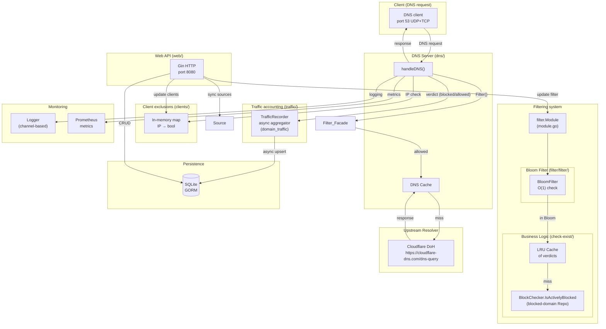
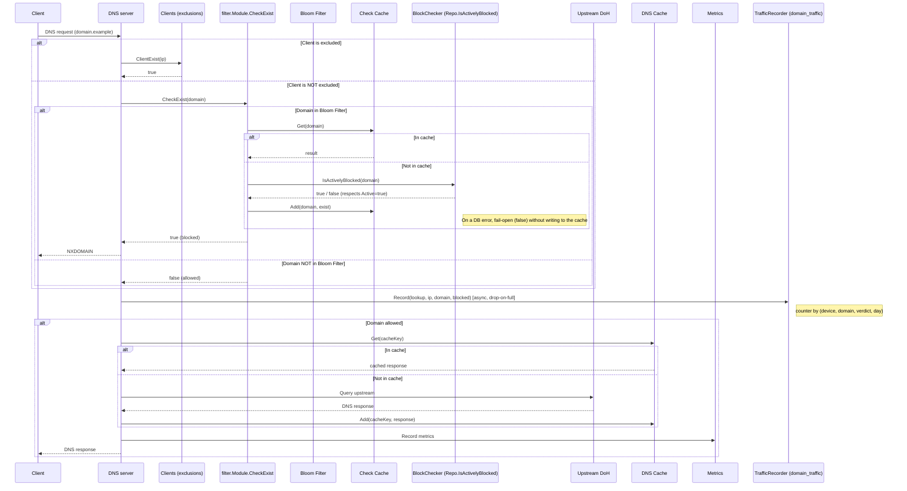

# DNS Filter — Architecture documentation

## Project overview

DNS Filter is a high-performance Go DNS server that filters domains against block/allow lists. The project uses an architecture with explicit layering: DNS request handling, filtering business logic, persistence, and the HTTP API.

## Project structure

```
dns-filter/
├── main.go                      # Entry point, component initialization
├── config/                      # Application configuration
├── db/                          # SQLite connection (GORM)
├── dns/                         # DNS server (miekg/dns)
├── filter/                      # Filtering logic
│   ├── filter/                  # Bloom filter
│   ├── cache/                   # Domain verdict cache
│   └── business/               # Filtering use cases
├── blocked-domain/              # Domain block list
│   ├── db/                      # DB access
│   ├── business/                # Use cases
│   └── web/                     # HTTP handlers
├── traffic/                     # Per-device traffic accounting (domain_traffic)
│   ├── db/                      # Counter model + reads/adapters
│   ├── business/                # Use cases (record, prune)
│   └── web/                     # Dashboard HTTP handlers
├── clients/                     # Per-IP client exclusions
├── source/                      # Syncing lists from external sources
├── dns-cache/                   # LRU cache of DNS responses
├── lru-cache/                   # Base LRU implementation
├── logger/                      # Channel-based logger
├── web/                         # HTTP API server (Gin)
├── metric/                      # Prometheus metrics
└── suggest-to-block/            # Intelligent suggestions
```

## Key components

### 1. DNS Server (`dns/`)

**Purpose:** Handle incoming DNS requests on port 53 (UDP + TCP).

**Key files:**
- `server.go` — the main DNS server

**Dependencies:**
- `logger` — request logging
- `dns-cache` — caching of upstream responses
- `filter` — checking domains for blocking
- `metric` — metrics collection
- `clients` — per-IP exclusion check (+ `identifier` to resolve the client to MAC/IP)
- `traffic` — asynchronous write of the per-device traffic counter (the `TrafficRecorder` port)

**Request handling flow:**
1. Receives a DNS request from the client.
2. Once per request, resolves the client into a `lookup` (`Identifier.Identify` → `{Kind: "mac"|"ip", Value}`); MAC is preferred over IP and survives DHCP IP churn.
3. Extracts the domain from the question.
4. Checks the client against the exclusion list (`clients`, keyed by `lookup`).
5. If the client is NOT excluded → calls `filter.CheckExist()`.
6. Writes the verdict (blocked/allowed) into the `domain_traffic` counter via `TrafficRecorder` — reusing the already-resolved `lookup`, non-blocking, drop-on-full (see the `traffic` component).
7. If the domain is blocked → returns NXDOMAIN.
8. If allowed → queries the upstream over DNS-over-HTTPS (Cloudflare DoH by default).
9. Caches the response in `dns-cache`.
10. Returns the response to the client.

### 2. Filtering (`filter/`)

**Purpose:** Decide whether a domain is blocked.

**Components:**

#### Bloom Filter (`filter/filter/filter.go`)
- A probabilistic data structure for fast domain-presence checks
- Loaded at startup from the `blocked-domain` DB
- Parameters: 10M elements, 0.1% false positives

#### Verdict cache (`filter/cache/cache-block.go`)
- LRU cache of domain-check results
- Capacity: 1500 entries
- Avoids repeated DB queries

#### Domain check (`filter/business/use-cases/check-exist/check-block.go`)
```go
func CheckBlock(deps Deps, domain string) bool {
    // 1. Check whether the filter is enabled (deps.Conf.Enabled) and there is no active pause
    // 2. Check the Bloom filter (deps.Bloom)
    // 3. If present in the Bloom → check the LRU cache (deps.Cache)
    // 4. If not in the cache → query the DB via deps.Repo (BlockChecker)
    // On any DB error — fail-open (false), without writing to the cache
}
```

`filter.Module` (composed in `main.go`) assembles `Deps` once and exposes `Module.CheckExist(domain)` for the DNS hot path.

### 3. Block list (`blocked-domain/`)

**Purpose:** Manage the list of blocked domains.

**DB model:**
```go
type BlockList struct {
    ID        uint
    Url       string    // domain
    Active    bool      // enabled/disabled
    Source    string    // source (Steven Black, Easy List, etc.)
}
```

**`*blocked-domain/db.Repo` operations:**
- `GetAllActiveURLs()` — the list of URLs with `Active=true` (used by `filter.Module.UpdateFromDb`)
- `IsActivelyBlocked(domain)` — the authoritative check respecting `Active` (hot path, the step after a bloom-hit + LRU-miss)
- `DomainNotExist(domain)` — duplicate validation for `CreateDomain`
- `CreateDomain` / `UpdateBlockList` — record management
- `CreateDNSRecordsByDomains` / `ChangeRecordStatusBySource` — bulk operations for `source.Module`

Block/allow event accounting moved out of the related `block_domain_events` table into the unified `domain_traffic` counter (see the **`traffic`** component below). The block counter (`POST /api/events/block/amount`, the headline number on the home page) is now computed as `SUM(count) WHERE blocked=true` from `domain_traffic` via `BlockStatsAdapter` — the JSON response shape is preserved. The `/api/events/block/amount-by-group` endpoint was removed: the "by domain" stats are fully covered by `GET /api/traffic/top-domains`.

### 4. Per-device traffic (`traffic/`)

**Purpose:** A unified counter of DNS requests per device — how many times each device queried each domain, split by blocked/allowed and bucketed by day. The `domain_traffic` table **replaced** the two former event tables (`block_domain_events` + `allow_domain_events`); it is a counter, not a journal — there are no per-request rows.

**DB model:**
```go
type DomainTraffic struct {
    ID          uint
    ClientKind  string    // "mac" | "ip" — how the device was identified
    ClientValue string    // MAC (preferred) or IP — the device KEY
    ClientIP    string    // last-seen IP — informational, for the UI
    Domain      string    // canonical FQDN
    Blocked     bool      // true = NXDOMAIN, false = forwarded upstream
    Day         time.Time // local-midnight — the day bucket
    Count       int64
    LastSeen    time.Time
    // UNIQUE(client_kind, client_value, blocked, domain, day) — the target of the additive upsert
}
```

**Device identity = MAC, fallback IP.** The write reuses the `lookup` already resolved on the hot path (`dns/server.go` → `Identifier.Identify`): `Kind: "mac"` when arpwatcher knows the MAC for the source IP, otherwise `Kind: "ip"`. The MAC is stable across DHCP IP churn — so a device stays the same dashboard row. ARP resolution is not re-triggered on the hot path. The box's self-queries (empty/loopback source IP) are dropped as noise.

**Day bucketing.** `Day` is the request time truncated to midnight in the **server's local timezone** (`time.Date(y,m,d,…, time.Local)`, NOT `time.Truncate(24h)`, which counts from the UTC epoch). Truncation happens where the aggregation key is built (the write worker).

**Write path (async aggregator).** `traffic/business/use-cases/record` (`TrafficEventStore`) — a buffered inbox channel → a single goroutine accumulates events in an in-RAM map keyed by `(kind, value, blocked, domain, day)` (Count++ + latest IP/LastSeen) and flushes them in a batch to the repo on a 20-second ticker or when capacity (the number of distinct keys) is reached. On channel overflow the event is **dropped** — the DNS reply never waits on a DB write. The flush is an additive upsert (`count = count + excluded.count`, `last_seen = MAX(...)`, `client_ip = excluded.client_ip`), with batches kept under SQLite's parameter limit.

**Reads.** `traffic/db` serves: the dashboard (`DeviceSummary`, `DomainsForDevice`, `TopDomains`); the headline block counter (`TotalCount` via `BlockStatsAdapter`); the suggest candidate pool (`GetAllowedDomains` = `DISTINCT domain WHERE blocked=false` via `AllowFilterAdapter`); domain-inspect (`IsAllowed` = EXISTS row blocked=false). domain-inspect **no longer** returns `block_events_total` — that counter went away with the table.

**HTTP (read-only, the `/traffic` dashboard).** Endpoints under the protected group: `GET /api/traffic/devices`, `GET /api/traffic/devices/domains` (the device is selected via the `kind`+`value` query params, because a MAC contains colons and is awkward in a path), `GET /api/traffic/top-domains`. Device rows are enriched on read from two sources: the vendor, via the pure-local `clients/discovery.LookupVendor` (no DB/network); and — for mac devices — a "friendly" hostname from the `host_names` table populated by the background mDNS collector (see `clients/hostnames/`, § below). Hostname resolution is best-effort: a single in-memory JOIN per request (`HostnameFunc` → `Repo.AllAsMap`), and a read failure returns an empty map and is logged, without bringing down the dashboard. The frontend picks the device label by priority hostname → vendor → IP, with the MAC/IP always remaining in the subtitle.

The `/traffic` page absorbed the former `/statistic` page: at the top, a headline number with a shared verdict filter (All/Blocked/Allowed; the number is computed as the sum across devices, without a dedicated endpoint); below it, **two tabs**: **Top domains** (the Top targets list under the same filter) and **Devices** (the device list). Clicking a device opens a **side panel** (`UDrawer direction="right"`) with a per-domain breakdown (its own verdict filter + pagination). The totals and `heroMetric` live in the `use-traffic-dashboard.ts` composable (covered by vitest).

**Retention (prune).** `traffic/business/use-cases/prune` — the single retention task (it replaced the two former `clear-events`). Once a day it deletes rows older than the window, reading the `retentionDays` atomic FRESH on every tick (`Run` → `pruneTaskAt`). The window is the `traffic_retention_days` dynamic setting (its Apply hook writes the same atomic), so a UI change takes effect on the next run without a restart. The atomic starts at the sentinel `0` ("not configured"): `pruneTaskAt` skips the run when it is `<=0`, so a prune accidentally launched BEFORE `HydrateAll` deletes nothing on a seed guess (which could be smaller than a larger override and wipe out days that were meant to be kept). `main` launches the goroutine strictly after `HydrateAll` (which always applies an override or the default), so the very first run is armed; the sentinel is insurance against future reordering.

### 5. Client exclusions (`clients/`)

**Purpose:** IP addresses for which filtering is disabled.

**Implementation:** A simple in-memory map synchronized with an RWMutex.

**Hostname collector (`clients/hostnames/`).** A background goroutine (LAN mode only, started alongside arpwatcher) that every `DefaultInterval` (10 min) browses the network over mDNS (`discovery.BrowseMDNS` — a lightweight discovery variant **without** the heavy active-ARP scan) and, for each announced `IP→name`, resolves the IP to a MAC via the same `arpwatcher`, then writes `MAC→hostname` into the `host_names` table (`clients/hostnames/db`). **The key is MAC only:** a device's MAC is stable for the duration of its network association (even a privacy-randomized one), whereas the IP changes with the DHCP lease — keying by IP would "glue" the name to an address that DHCP later hands to a different device. A host whose MAC is unknown at sweep time is simply skipped (re-learned on the next sweep) rather than written under its IP. Coverage is partial by nature: devices that announce nothing over mDNS (some Android phones, much IoT) get no name here and fall back to vendor/IP in the UI. The sweep self-times-out (~5s in `BrowseMDNS`); a partial mDNS error is logged but does not cancel the sweep; departed devices are cleaned up by `PruneOlderThan(DefaultTTL=30d)` after each run. This is a consumer/complement to the on-demand scanner `POST /api/clients/discover` (the same mDNS machinery, but button-triggered and without persistence). That scanner also reads the kernel ARP table, and since the container runs on the host network namespace it sees the host's Docker bridges (`docker0` / `br-<hash>`); neighbours learned on those interfaces are filtered out by interface name (`discovery.isDockerBridgeIface`, applied to the Device column of `/proc/net/arp` and to `FindLocalSubnet`'s scan-target choice) rather than by guessing IP ranges — so Docker networks in any subnet are excluded while a real LAN is never dropped. mDNS results need a second filter: they carry only an IP, not a learning interface, and on host networking the box answers the browse on every docker0/br-* address it owns (surfacing itself as `172.18.0.1`, `172.24.0.1`, … with `Source: "mdns"`). So `Discover` also drops any device whose IP falls inside a real Docker bridge subnet — `dockerBridgeNets()` reads those subnets straight off the host's bridge interfaces, so it's exact, not a guess. The filter is on by default but caller-controllable: `POST /api/clients/discover` accepts `{"filter_docker": false}` (UI checkbox *Filter Docker networks*, default on) to include those neighbours. The arpwatcher always excludes them.

### 6. Source synchronization (`source/`)

**Purpose:** Download block lists from external sources.

**Supported sources:** Steven Black's hosts, HaGeZi (hosts format); EasyList, RuAdList, AdGuardRussian (EasyList/AdBlock format).

**EasyList-format parser (`easy-list/`).** Converts AdBlock rules into bare domains for the DNS block list. Only an unconditional `||domain^` rule can be flattened into a domain. A rule with contextual/partial modifiers (`$domain=`, `$third-party`, `$popup`, resource types, `$badfilter`, `$dnsrewrite`, …) is **discarded entirely** — the DNS filter does not know the page context, and stripping `$...` while blocking the bare domain would turn the browser rule `||mail.ru^$domain=dzen.ru` into a global block of `mail.ru`. Only `$important` and `$all` are allowed — they do not narrow a full domain block (`dnsSafeModifiers`, an allowlist approach: an unknown modifier makes the rule non-flattenable). Additionally, `IsSafeDNSDomain` discards bare public suffixes (`||ru^` → `ru`) and wildcard rules.

**Sync process** (`Sync`, run in the background at startup — `backgroundSync` in `main.go`, plus a manual trigger from the web; there is no periodic re-sync, the "next sync" = the next process start):
1. Download and parse each active source. A failure of one source is logged and does not abort the rest — it simply does not reach the write stage, its domains are kept; but the whole batch is marked `complete = false`.
2. **Add phase** — `CreateDNSRecordsByDomains` per source: an upsert (dedup + `INSERT OR IGNORE`) of the fresh set.
3. **Prune phase** — `pruneVanishedDomains`: for each source, `DeleteDNSRecordsBySourceNotIn` hard-deletes its `block_lists` rows that are absent from the **union of all** fresh sets.

`Sync()` is self-cleaning: a domain that dropped out of the sources is removed from `block_lists`. Prune-phase subtleties:
- **Diff against the union, not against its own list.** A domain is a single row with a single `source` (the first writer). If it dropped out of its "owning" list but exists in another, diffing only against its own set would delete it. So we prune against the union of all fresh sets.
- **Skip when `complete = false`.** A failed source is absent from the union — the prune is skipped entirely, otherwise its domains would be deleted.
- **Skip an empty source.** A source parsed into an empty set is not pruned: an empty parse is more likely a garbage response than a list that genuinely emptied.
- Deletion is strictly by `source` — `User`/`AutoBlocked`/`SuggestedToBlock` are untouched. Surviving rows keep their `id`/`created_at`. Deletions run in a single transaction.

### 7. DNS cache (`dns-cache/`)

**Purpose:** Cache upstream-resolver responses while respecting TTL (RFC 1035 §3.2.1, RFC 2308).

**Implementation:**
- A doubly-linked-list-backed LRU cache (`lru-cache/`)
- Capacity: 1500 entries
- Each entry stores `cachedAt` and `expiresAt`; expiresAt = cachedAt + minTTL
- Positive responses: `expiresAt` is computed from the minimum `RR.Ttl` across the Answer/Authority/Additional sections (the pseudo-RR OPT is ignored — its Ttl field is used for EDNS flags)
- Negative responses (NXDOMAIN, NODATA): TTL = `min(SOA.Minttl, SOA.Hdr.Ttl)` (RFC 2308 §5), then clamped to `DefaultNegativeTTLCap = 300s`, so a single faulty SOA with a huge minimum cannot stick for a day
- Not cached: truncated responses (TC=1, RFC 7766 — the client must retry over TCP), SERVFAIL and any Rcode other than Success/NXDOMAIN, responses with `TTL=0`, negative responses without SOA
- An expired entry stays in the LRU (it is not removed on `Get`) — the next `Add` updates the slot in-place; in-place removal would race with a concurrent `Add` for the same key
- On a cache hit, `Get` returns a fresh copy of `*dns.Msg` whose `RR.Ttl` is decremented by the time spent in the cache (with floor=1, so a downstream resolver does not interpret 0 as "do not cache")
- Expired entries are removed from the LRU on the first access to them
- Metrics: hits, misses, evictions, size, **expired** (Prometheus)

**Singleflight (coalescing to upstream).** On a cache miss, the trip to upstream goes through a `singleflight.Group` keyed by `name+qtype` (`dns/singleflight.go`). If N clients simultaneously request the same domain on a cold cache, exactly one HTTP request is made to DoH and the rest wait for its result — this eliminates the thundering herd on a cold start and at TTL expiry for popular domains. Inside `fn`, before going to upstream, the cache is re-checked (double-check) in case a previous in-flight call just populated it. The result handed to multiple callers is copied (`msg.Copy()`) before being returned, otherwise mutating `msg.Id` in different goroutines would race. Metric: `dns_singleflight_coalesced_total` — the number of requests whose upstream call was stitched onto an already-in-flight one.

**Stale-while-revalidate (RFC 8767).** On top of the normal TTL, each entry has `staleUntil = expiresAt + CacheStaleGrace` (default +24h, positive responses only; NXDOMAIN/NODATA have `staleUntil = expiresAt`). `Lookup(key)` returns one of four states — `Fresh`, `Stale`, `Expired`, `Miss`. On a `Stale` hit the server behaves in one of two ways:

- **Proactive SWR (`DNS_FILTER_CACHE_SWR=true`, default).** The client immediately receives a stale response with `RR.Ttl` clamped to `CacheStaleTTL` (30s by default, as RFC 8767 §6 recommends — so the client comes back quickly for a fresh one). In the background, `refreshWorker` (`dns/swr.go`) fires a refresh through the same singleflight as the hot path: if someone does a real `Miss` at that moment, they attach to our refresh instead of their own upstream request. Concurrent refreshes are bounded by the `CacheRefreshConcurrency` semaphore (32 by default); on overflow new refreshes are dropped (metric `dns_swr_refresh_total{result="dropped"}`) and stale keeps being served — the next stale hit will try again.
- **SWR off (`DNS_FILTER_CACHE_SWR=false`).** A stale hit falls through to a synchronous upstream — the behavior from before the PR. The stale entry stays in the cache and is used as a fallback in serve-stale-on-error.

**Serve-stale-on-error (always on while `CacheStaleGrace > 0`).** If the synchronous upstream call failed (network, DoH timeout), the server does a second `Lookup`: if `Stale` is present it is returned to the client with the metric `dns_serve_stale_on_error_total` — RFC 8767 behavior that gives resilience to short Cloudflare blips without serving SERVFAIL to users.

The refresh context is *not* tied to the client's — the client already got a stale response, and cancelling its `ctx` must not kill the refresh. The refresh uses its own `context.WithTimeout(Background, 5s)`.

**Manual cache flush (`POST /api/dns-cache/clear`, `dns-cache/web/`).** The operator can drop all entries at once via the Settings page or directly through the API — needed, for example, after rotating an upstream record with a long TTL. The handler calls `CacheWithMetrics.Clear()`, which delegates to the LRU and resets the `dns_cache_size` gauge. The `dns_cache_evictions_total` counter is deliberately **not** incremented: a manual flush is an operator action, not LRU pressure; conflating these signals would break "cache too small" alerts. The response returns the number of removed entries so the UI can show `cleared N entries`. The endpoint is protected by the shared auth middleware like the rest of `/api/*`.

### 8. Logging (`logger/`)

**Purpose:** Centralized logging with support for multiple handlers.

**Architecture:**
- A channel-based logger (async, does not block the main path)
- A `Handler` interface for plugging in various outputs
- Levels: DEBUG, INFO, WARN, ERROR

**Handlers:**
- Console (`logger/handlers/console/`)
- Loki (`logger/handlers/loki/`)

### 9. Web API (`web/`)

**Purpose:** The HTTP API for managing the system.

**Port:** 8080

**Self-routing.** `web/server.go` is thin — it owns only cross-cutting concerns: CORS, the public/protected split, Swagger. Each feature registers its own paths:

- DI features (`blocked-domain`, `filter`, `suggest-to-block`, `source`) expose a method `(h *Handlers) RegisterRoutes(rg *gin.RouterGroup)`.
- Non-DI features (`auth`, `clients`, `db`, `dns-cache`, `domain-inspect`, `logger`) expose a package function `Register(rg *gin.RouterGroup)`.
- `auth/web` is a special case: `RegisterPublic(r gin.IRouter)` mounts `POST /api/auth/login` outside `RequireAuth()`, while everything else goes through the usual `Register(rg)` under protection.

The contract is pinned by the regression test `web/server_test.go::TestBuildRouter_RegistersAllExpectedRoutes` — a snapshot of the full `(method, path)` set is compared with what `gin.Engine.Routes()` returns after `buildRouter`. Any accidental route removal/rename fails in CI.

**Endpoints:**

| Route | Description |
|---------|----------|
| `POST /api/dns-records` | Get the list of blocked domains |
| `POST /api/dns-records/create` | Add a domain to the block list |
| `POST /api/dns-records/update` | Change a domain's status |
| `GET /api/filter/status` | Get the filter status |
| `POST /api/filter/change-status` | Enable/disable the filter |
| `POST /api/events/block/amount` | The number of blocks (the headline number) |
| `POST /api/suggest-to-block` | Block suggestions |
| `POST /api/sources` | Source management |
| `POST /api/exclude-clients` | Client exclusion management |
| `POST /api/config/logger/*` | Logging management |

### 10. Metrics (`metric/`)

**Purpose:** Collect and export metrics to Prometheus.

**Metrics:**
- `dns_cache_hits_total` — cache hits
- `dns_cache_misses_total` — cache misses (including expired entries)
- `dns_cache_evictions_total` — cache evictions
- `dns_cache_expired_total` — lookups that found a TTL-expired entry (counted separately from cold misses: it shows how often upstream returns short TTLs)
- `dns_cache_size` — the current cache size
- `dns_cache_stale_hits_total` — lookups that landed in the SWR window (past TTL but within `staleUntil`); growth = SWR is working on popular domains with expired TTL
- `dns_singleflight_coalesced_total` — requests whose upstream call was stitched onto an already-in-flight one (protection against the thundering herd on a cold cache)
- `dns_swr_refresh_total{result="ok|error|dropped"}` — background refreshes; `dropped` = the semaphore was full and the refresh was skipped (stale is served anyway)
- `dns_serve_stale_on_error_total` — a response was served from the stale window because upstream failed (RFC 8767)

**DB metrics (`db/`):**
- `sqlite_file_size_bytes` — the on-disk SQLite file size (gauge, refreshed every 10 min)
- `db_query_duration_seconds{operation}` — a latency histogram for each GORM operation (`create`/`query`/`update`/`delete`/`row`/`raw`); captured by before/after callbacks attached in `GetConnection`. The buckets are tuned for sub-millisecond reads with headroom up to 5s — the upper tail is the "DB is slow" signal. This is the **primary** DB-latency indicator (p50/p95/p99 via `histogram_quantile`)
- `db_query_errors_total{operation}` — operations that ended in an error; `gorm.ErrRecordNotFound` is deliberately **not** counted (an empty `First()` on the DNS path is normal control flow, not a failure)
- `go_sql_*{db_name="main"}` — `database/sql` pool stats via `collectors.NewDBStatsCollector` (open/in-use/idle connections, `wait_count_total`, `wait_duration_seconds_total`). For the glebarez/modernc driver the pool is the write-serialization point, so a growing `go_sql_wait_duration` is the clearest sign the DB has become the bottleneck

**Connection tuning (`db/connect.go`).** PRAGMAs are set via the **DSN** (`?_pragma=...` in `buildDSN`), not by a one-off `db.Exec` after opening: the modernc driver runs `_pragma` on **every** new pool connection, whereas `db.Exec("PRAGMA …")` configures only the single connection that served it (in prod the pool opened 3 — `synchronous=NORMAL` and the 64 MB cache settled on one, the others silently ran `FULL` + 2 MB). `journal_mode=WAL` persists in the file header and is global either way; `busy_timeout=5000` is set by the driver on each connection — it is duplicated in the DSN only for clarity. The pool is bounded by `SetMaxOpenConns(maxOpenConns)`: the former default `0` (unlimited) only amplified write contention; a small limit preserves concurrent reads (WAL), while writes serialize behind `busy_timeout`.

**Runtime metrics:** the standard `go_*` and `process_*` from `collectors.NewGoCollector`/`NewProcessCollector` (goroutines, heap memory, GC pauses, CPU, file descriptors) plus `logger_dropped_logs_total` (logs lost on logger-channel overflow).

**Grafana dashboards (`grafana/dashboards/`):** `dns-filter.json` — DNS/cache; `runtime-db.json` — container monitoring (Go runtime: memory, goroutines, GC, CPU, FD) and DB (per-operation latency, distribution heatmap, the connection pool). Provisioned from files in `grafana/provisioning/` (UI edits are overwritten on the next sync).

### 11. Suggest to Block (`suggest-to-block/`)

**Purpose:** Intelligent suggestions for blocking domains.

**Algorithms:**
- Domain similarity (Damerau-Levenshtein)
- Entropy (Shannon)
- "Bad words" filtering
- Brand impersonation, homograph, hex/UUID, numeric run, risky TLD

**Schedule:** Every 12 hours (cron)

**Auto-block during Collect.** Each suggestion is passed through `ShouldAutoBlock` (see `business/use-cases/collect/collect.go`) and automatically promoted to the block list with `Source = AutoBlocked` if any of these hold:
- `Score >= ThresholdToAutoBlock` (60) — two strong signals independently agreed;
- `CodeSubdomainOfBlocked` is among the reasons — the parent is already in the block list, so the subdomain is almost certainly from the same family (the most deterministic signal — it bypasses the score gate).

**PSL guard.** `subdomainAncestors` (see `buildBlockedIndex`) drops from the subdomain set any `blocked` entry that is itself a public suffix (`golang.org/x/net/publicsuffix`: `ru`, `co.uk`, `xyz`, …). Otherwise a broken source rule (e.g. `||ru^$third-party` from RuAdList, which the EasyList parser should have discarded — see `IsSafeDNSDomain`) or a manual user error would make a TLD the "parent" of every `*.ru` domain in the allowed pool, and `ShouldAutoBlock` would bulk-promote the entire RuNet into the block list (incident 2026-05-14, 25 auto-blocks in a single run). The protection is duplicated: the parser does not let a PSL into `block_lists`, and the index does not trust existing rows. (The suggest candidate pool — the "allowed domains" — is now read from `domain_traffic` via `AllowFilterAdapter`, not from the removed `allow_domain_events`; the `AllowRepo` port itself did not change.)

**AutoBlocked source kill-switch.** Before processing a batch, `Collect()` reads `source_db.IsActive(SourceAutoBlocked)`. If the operator disabled the source in the UI (`POST /api/sources/change-status`), auto-promotion is turned off entirely: candidates that would otherwise pass `ShouldAutoBlock` fall into the normal branch and are written to `suggest_blocks` for manual triage, and the bloom is not rebuilt. Without this gate `ChangeRecordStatusBySource` would set `Active=false` on existing rows, but the next Collect tick would insert new ones with `Active=true` — disabling would be pointless. On a status-read error it fails closed (auto-block is turned off), so the kill-switch is not bypassed on a transient DB problem.

The remaining suggestions (score in `[30, 60)` without subdomain-of-blocked) still go to `suggest_blocks` for manual moderation via `POST /api/suggest-to-block/add-to-block`. After the auto-promotions, `Collect()` calls `m.filter.UpdateFromDb()` once (the `Filter` port) to refresh the in-memory bloom without a per-domain rebuild.
**Persisted reason codes (#95).** Auto-block promotes a domain via `create_domain.CreateDomain` with a populated `RequestBody.Reasons`, and the repository writes the `block_lists` row together with its reason codes (`block_list_reasons`: `block_list_id`, `code`, `match_value`, FK with `OnDelete:CASCADE`) in a **single transaction** (`Repo.CreateDomainWithReasons`). This makes the reason for an auto-block available from the DB and API without logs — the application log rotates and is not a long-term audit trail. The table is populated only for `AutoBlocked` records; manual additions and the ~426k rows from external sources carry no reason codes. Idempotency is free: a repeat `Collect()` hits `DomainNotExist` and does not produce duplicates. Each decision is additionally logged (`Auto-blocked domain from suggest: ... score: ... reasons: ...`).

**Reputation enrichment (opt-in, `suggest-to-block/inspect/`).** Lexical analysis is a weak signal: a scammer only needs a "normal" name. On top of it there is a **second-stage funnel** that reuses the strong checks from `domain-inspect` (RDAP age + VirusTotal + Safe Browsing). Scoring is decoupled from thresholds: `collect.ScoreCandidates` does one pass and returns every domain with `score > 0`; `Collect` sorts them into buckets:
- `score >= 30` → `suggest_blocks` / auto-block (as above, unchanged);
- `score ∈ [10, 30)` → the `inspect_candidate` **queue** (only if the worker is enabled; otherwise the domain is dropped, as before — behavior is identical);
- `score < 10` → dropped.

The queue is drained by a separate background **worker** (`inspect.Worker`, its own ctx-aware ticker, NOT `periodic.Run`). Per tick it takes the `Budget` highest-scoring candidates (`PickForInspection`), inspects them one at a time with a `Pause` between external calls, and decides by the summary verdict (`domain_inspect.summarize`):

| verdict | action |
|---|---|
| `malicious` | kill-switch on → auto-block (the same `create_domain.CreateDomain` + one `UpdateFromDb`) and `Drop` from the queue; off → `UpsertWithInspect` into `suggest_blocks` |
| `suspicious` | `UpsertWithInspect` into `suggest_blocks` (surfaces even with weak lexical signal) |
| `clean` | `SaveResult(clean)` — cached, leaves the eligible set until TTL (not `Drop`: otherwise the next `Collect` would return the domain and burn quota on re-inspection) |
| `unknown`/error | `ScheduleRetry`; after `MaxErrors` — `SaveResult(unknown)` |

The `suggest_blocks` row's `Score` stays **lexical**; the inspect verdict lives in the `inspect_*` reason codes (`inspect_vt_malicious`, `inspect_safe_browsing`, `inspect_rdap_young`, `inspect_clean_endorsed`). `UpsertWithInspect` is idempotent across runs: lexical reasons are preserved, only `inspect_*` ones are updated (removal by the `InspectReasonPrefix` prefix — no lexical code starts with `inspect_`, which is pinned by a test).

**Quotas and caching.** The binding constraint is the free VirusTotal tier (4 req/min, 500/day). Hence: a small `Budget` (5) + a 20s pause between domains (`Budget × ticks/day` ≪ 500), and a two-level cache — the `inspect_candidate` row is itself a per-FQDN cache (`PickForInspection` skips ones fresher than `CacheTTL`), plus an `rdap_cache` keyed by eTLD+1 so neighboring FQDNs of one domain do not hit RDAP repeatedly. On HTTP 429 (`domain_inspect.StatusRateLimited`) the adapter returns `ErrRateLimited` and the worker **aborts the whole run**, leaving the current domain untouched (this is a "run pause", not a retry). The prune (`inspect.StartPrune`, modeled on `traffic_prune`) deletes rows not inspected for longer than `4×CacheTTL`.

**Privacy / enabling.** The worker sends observed local-network domains to VirusTotal/Google — so it is **off by default**. The master toggle (`suggest_inspect_enabled`) and both provider keys (`virustotal_key`, `safebrowsing_key`) moved to DB settings and are managed from the UI:
- the worker and `StartPrune` now **always** start (after `HydrateAll`), but `Worker.RunOnce` is a no-op while the `suggest_inspect_enabled` flag is off; without a key the provider check returns `skipped`, and RunOnce sends nothing outward;
- `Module.Collect` routes weak candidates into `inspect_candidate` only when the flag is on — otherwise the queue does not grow during the pause;
- the keys are returned masked in the API (`••••<last 4>`) and stripped from the exported DB copy (`/api/config/db/download` uses `VACUUM INTO` + `DELETE FROM settings WHERE key IN (…)`), so neither a UI screenshot nor a migration dump leaks the secret.

The rest of the config — the env variables `DNS_FILTER_SUGGEST_INSPECT_*` (Budget, Interval, Pause, Backoff, CacheTTL, MaxErrors) — stays env-only: this is behavior under load, properly tuned by the operator once at deploy time rather than hot via the UI. Prometheus metrics: `suggest_inspect_decisions_total{verdict}`, `_rate_limited_total`, `_errors_total`, `_queue_depth`, `_rdap_cache_hits_total`.

---

### 12. Settings (`settings/`)

A typed KV store of runtime configuration persisted in the DB. It solves the problem "some settings should survive a restart and be changeable without editing env".

**Layers:**
- `settings/db` — the `settings(key PK, value, updated_at)` table + `Repo` (`Get/Set(upsert)/GetAll/Delete`). The table is deliberately generic (KV): adding a new setting requires no migration.
- `settings/` (Module) — a registry of **descriptors** `Setting{Key, Type, Enum, Default, Validate, Apply}` + orchestration under a write mutex:
  - `Set(key, raw)` → `Validate → repo.Set (persist first, the DB is the source of truth) → Apply`. An invalid value is neither persisted nor applied; a persist error never reaches `Apply`.
  - `Reset(key)` → `repo.Delete → Apply(Default)` (return to env control).
  - `HydrateAll()` — at startup, for each key, applies the effective value (`DB override → env default`). Both hydration and a runtime change go **through the single** `Apply` path. A broken value in the DB (e.g. an enum narrowed between versions) does not break startup: the default is substituted and the problem is returned in an aggregated error.
- `settings/web` — `GET /api/settings` (effective values + type metadata for the UI), `PUT /api/settings/:key`, `DELETE /api/settings/:key` (reset). The module's sentinel errors are mapped: unknown key → 404, invalid value → 400.

**Apply hooks (inversion of control).** The module knows nothing about logger/dns/cache. In `main.go` (the composition root, file `settings_wiring.go`) the descriptors are wired to runtime sinks: `log_level`→`ChanLogger.UpdateLogLevel`; `doh_upstream`/`doh_bootstrap_ips`→`dns.ReloadableResolver.SetEndpoint/SetBootstrapIPs` (+ a dns-cache flush); `cache_swr`→`DnsServer.SetSWR`; `cache_stale_grace`/`cache_stale_ttl`→`CacheWithMetrics.SetStaleGrace/SetStaleTTL`; `cache_refresh_concurrency`→`DnsServer.SetRefreshConcurrency`; `traffic_retention_days`→`traffic_prune.SetRetentionDays` (writes the atomic that the prune loop reads fresh on every tick); `suggest_inspect_enabled`→`suggest_inspect.SetEnabled` (read by `Worker.RunOnce` and `suggestModule.Collect`); `virustotal_key`/`safebrowsing_key`→`checks.SetVTKey`/`SetSBKey` (read by the provider check on every HTTP request).

**Secrets in KV (`Type: "secret"`).** The pipeline above does not scale to API keys directly: dumps and UI screenshots leak the plain value. So the secret type gets two protections:
- in `effectiveViewLocked` the value and default are masked to `••••<last 4 characters>`; the UI renders a password input, the mask goes into the placeholder, and the draft starts empty (nothing to submit "by accident");
- `db/web/download.go::DownloadDb` does a `VACUUM INTO` to a temp file and a `DELETE FROM settings WHERE key IN (m.SecretKeys())` in the copy. The live DB is untouched; secret keys never leave the host via `/api/config/db/download`. `Apply` itself receives the original raw — the provider check reads the atomic without the mask.

**A DB-free hot path.** All dynamic settings are read on the hot path from memory (atomics), the DB is persistence only. Specifically: `ChanLogger.level` (`atomic.Int32`, which also removed a race with the logger goroutine), `DnsServer.swrEnabled` (`atomic.Bool`), `Cache.staleGrace/staleTTL` (`atomic.Int64`), the upstream — via `dns.ReloadableResolver` (`atomic.Pointer[DoHResolver]`, swapped without a restart; the same instance is visible to both the server and the refresh worker), the refresh pool — a rebuildable semaphore behind an `atomic.Pointer` (an in-flight refresh releases its token back into the semaphore it took it from).

**Adding a new dynamic setting** = one `settings.Setting{...}` entry in `registerDynamicSettings` + a setter on the relevant sink. No migration and no `web/server.go` edit are needed.

---

## Component interaction diagram



---

## DNS request handling flow



---

## Configuration

Parameters are read from environment variables (or `.env`):

| Variable | Description | Default |
|------------|----------|----------------------|
| `DNS_FILTER_DOH_UPSTREAM` | Upstream DoH endpoint | `https://cloudflare-dns.com/dns-query` |
| `DNS_FILTER_DOH_BOOTSTRAP_IPS` | IP addresses of the DoH endpoint, to connect without system DNS | `1.1.1.1,1.0.0.1` |
| `DNS_FILTER_DBPATH` | SQLite path | `./filter.sqlite` |
| `DNS_FILTER_LOG_LEVEL` | Log level | `INFO` |
| `DNS_FILTER_METRIC_ENABLE` | Enable metrics | `false` |
| `DNS_FILTER_METRIC_PORT` | Metrics port | `2112` |
| `DNS_FILTER_CACHE_SWR` | Enable proactive stale-while-revalidate (serve stale immediately + refresh in the background). `false` → a stale hit goes to a synchronous upstream; serve-stale-on-error still works. | `true` |
| `DNS_FILTER_CACHE_STALE_GRACE` | The window past `expiresAt` during which a positive entry is considered serveable as stale. `0` disables SWR and serve-stale-on-error entirely. For NXDOMAIN/NODATA it is forced to `0`. | `24h` |
| `DNS_FILTER_CACHE_STALE_TTL` | The TTL on RRs in a stale response to the client (RFC 8767 §6 recommends ≤ 30s). | `30s` |
| `DNS_FILTER_CACHE_REFRESH_CONCURRENCY` | The maximum number of concurrent background refreshes; on overflow new refreshes are dropped and stale keeps being served. | `32` |
| `DNS_FILTER_TRAFFIC_RETENTION_DAYS` | How many days `domain_traffic` counters are kept; the daily prune deletes rows older than the window. Dynamic (changeable in the UI), range 1..3650. | `30` |

### The three tiers of settings

Configuration falls into three classes — this is an explicit architectural decision, not an accident:

1. **Boot-time static (env only).** `DNS_FILTER_DBPATH`, `DNS_FILTER_MODE`, the ports (`:53`/`:8080`/metrics). By nature they require a restart (chicken-and-egg with the DB, socket binding, wiring branching at startup) — they are not moved to the DB.
2. **Secrets (env only).** `DNS_FILTER_ADMIN_PASSWORD`, `DNS_FILTER_VT_KEY`, `DNS_FILTER_URLSCAN_KEY`, `DNS_FILTER_SAFE_BROWSING_KEY`. Storing them as plaintext in SQLite would lower security, so they stay in the environment.
3. **Dynamic (env → DB).** `DNS_FILTER_LOG_LEVEL`, `DNS_FILTER_DOH_UPSTREAM`, `DNS_FILTER_DOH_BOOTSTRAP_IPS`, all `DNS_FILTER_CACHE_*`, `DNS_FILTER_TRAFFIC_RETENTION_DAYS`. They can be changed at runtime via `/api/settings`; the value is **persisted in the DB and survives a restart**. Precedence: `DB (if an override exists) → env → compiled default`. The env variable serves as the primary default; once a setting is changed through the UI, the DB becomes the source of truth until the override is deleted (`DELETE /api/settings/:key` → back to env). See the **`settings/`** component below.

The filter state (`Enabled`, `PausedUntil`) is also persisted in the same KV table (keys `filter_enabled`/`filter_paused_until`), but not via the generic registry — instead write-through from the filter use-cases, which have their own endpoints (`change-status`/`pause`/`resume`) and pause-duration validation.

---

## Dependencies (go.mod)

- `github.com/miekg/dns` — DNS server
- `github.com/bits-and-blooms/bloom/v3` — Bloom filter
- `gorm.io/gorm` + `github.com/glebarez/sqlite` (on `modernc.org/sqlite`) — ORM and a pure-Go SQLite driver (no CGO)
- `github.com/gin-gonic/gin` — HTTP framework
- `github.com/prometheus/client_golang` — Metrics
- `github.com/joho/godotenv` — .env files

---

## Entry point (main.go)

`main.go` is the single composition root. `db.GetConnection()` is called exactly once; the other packages receive their dependencies through constructors:

```go
func main() {
    // 1. DB migration and admin bootstrap
    migrate.Migrate()
    authBusiness.BootstrapAdmin()

    conn := app_db.GetConnection()
    conf := config.GetConfig()
    chanLogger := logger.GetLogger()

    // 2. Repos (one per feature) — the only place where *gorm.DB appears
    blockRepo    := blocked_domain_db.NewRepo(conn)
    sourceRepo   := source_db.NewRepo(conn)
    suggestRepo  := suggest_to_block_db.NewRepo(conn)
    settingsRepo := settings_db.NewRepo(conn)
    trafficRepo  := traffic_db.NewRepo(conn)

    // 3. filter.Module: absorbs the bloom + LRU cache singletons
    bloom := filter_bloom.GetFilter()
    cache := filter_cache.GetCache()
    filterModule := filter.NewModule(blockRepo, bloom, cache, conf, chanLogger)

    // 4. Sources: seed the catalog (the list sync moves to the background, step 7)
    sourceModule := source.NewModule(sourceRepo, blockRepo, chanLogger)
    sourceModule.Seed()

    // 5. Bloom = a snapshot of active domains from what is ALREADY in the DB
    if err := filterModule.UpdateFromDb(); err != nil { panic(err) }
    if err := clients.Sync(); err != nil { panic(err) }

    // 6. Suggest + domain-inspect read "allowed domains" from domain_traffic
    //    (via adapters — the ports do not change). Background tasks: the single
    //    retention prune over domain_traffic (it replaced the two clear-events tasks).
    trafficAllowAdapter := traffic_db.NewAllowFilterAdapter(trafficRepo)
    suggestModule := suggest_to_block.NewModule(
        blockRepo, trafficAllowAdapter, sourceRepo, filterModule, suggestRepo, chanLogger,
    )
    domain_inspect_checks.SetAllowLookup(trafficRepo.IsAllowed)
    go suggestModule.Start(context.Background())
    go authBusiness.ClearExpiredSessions()
    // LAN mode: arpwatcher (IP↔MAC) + the hostname collector (mDNS → host_names).
    if conf.Mode == config.ModeLAN {
        go arpwatcher.Run(context.Background(), chanLogger, arpwatcher.DefaultInterval)
        go (&hostnames.Collector{Browse: discovery.BrowseMDNS, MACs: arpwatcher.Get(), Store: hostnamesRepo, Log: chanLogger}).Run(context.Background())
    }

    // 7. DNS server: filter.CheckExist as a method value; trafficWorker is the single
    //    verdict recorder (the event stores were removed).
    cacheWithMetric := dns_cache.GetCacheWithMetric()
    metricInstance := dns.CreateMetric()
    trafficWorker := traffic_record.NewTrafficEventStore(trafficRepo, chanLogger, 2000)
    resolver := dns.NewReloadableResolver(conf.DoHUpstream, conf.DoHBootstrapIPs...)
    dnsServer := dns.CreateServerWithResolver(
        chanLogger, cacheWithMetric, filterModule.CheckExist, metricInstance,
        buildIdentifier(conf.Mode), resolver,
    )
    dnsServer.Traffic = trafficWorker

    // 8. settings: descriptor declaration (incl. traffic_retention_days), restore
    //    of the filter state, HydrateAll — strictly before Serve. Then backgroundSync in the background.
    settingsModule := settings.NewModule(settingsRepo)
    registerDynamicSettings(settingsModule, dynamicSettingsDeps{ /* conf, logr, resolver, cache, dnsServer */ })
    filterModule.SetStateSink(filter.PersistHook(settingsRepo, chanLogger))
    _ = filter.RestoreState(settingsRepo, conf)
    _ = settingsModule.HydrateAll()
    // The retention prune over domain_traffic starts ONLY after HydrateAll: the first
    // (immediate) run already sees the effective window, not the seed sentinel.
    go traffic_prune.Run(trafficRepo)
    go backgroundSync(sourceModule.Sync, filterModule.UpdateFromDb, chanLogger)

    // 9. HTTP API: all per-feature *Handlers are gathered into web.Handlers and passed explicitly
    web.CreateServer(web.Handlers{
        Blocked: &blockedWeb.Handlers{Repo: blockRepo, Log: chanLogger, RefreshFilter: filterModule.UpdateFromDb,
            BlockStats: traffic_db.NewBlockStatsAdapter(trafficRepo)},
        Filter:   &filterWeb.Handlers{Module: filterModule},
        Suggest:  &suggestWeb.Handlers{Repo: suggestRepo, BlockRepo: blockRepo, Filter: filterModule, Log: chanLogger},
        Source:   &sourceWeb.Handlers{Repo: sourceRepo, BlockRepo: blockRepo, Filter: filterModule, Log: chanLogger},
        Settings: &settingsWeb.Handlers{Service: settingsModule},
        Traffic:  trafficWeb.NewHandlers(trafficRepo, discovery.LookupVendor, hostnamesRepo.AllAsMap, chanLogger),
    })

    if err := dnsServer.Serve(); err != nil { panic(err) }
}
```

Load-bearing ordering:
- `migrate.Migrate()` must run before `NewRepo(conn)` — a Repo silently breaks on its first write without a schema.
- `filterModule.UpdateFromDb()` (the startup, synchronous one) raises the bloom from what is **already** in the DB, BEFORE the DNS starts — a restart immediately serves the previous block list. On a genuine first run the DB is empty and nothing is blocked until the background sync completes (a deliberate trade-off for a non-blocking start).
- `sourceModule.Sync()` moved out of the synchronous path into the `backgroundSync` goroutine — the DNS server starts without waiting on the network. When the sync completes, `backgroundSync` calls `filterModule.UpdateFromDb()` again (rebuilds the bloom + clears the verdict cache). The goroutine **does not panic**: a `panic` would kill an already-serving DNS server. A failed sync (usually no network on first boot) is retried with exponential backoff (`syncRetryBaseDelay` → `syncRetryMaxDelay`) until it succeeds.
- `clients.Sync()` — after Migrate, before DNS Serve (a local DB read, no network).
- `trafficWorker` (`traffic_record.NewTrafficEventStore`) is assigned to `dnsServer.Traffic` BEFORE `Serve()` — it is the single verdict recorder after the event stores were removed. The two former `clear-events` goroutines (block/allow) and their event stores are gone; in their place is a single `traffic_prune.Run(trafficRepo)` goroutine (daily retention over `domain_traffic`), launched **after `HydrateAll`** so the first immediate run already sees the effective retention window rather than the seed sentinel. suggest/domain-inspect get "allowed domains" from `trafficRepo` via adapters (`NewAllowFilterAdapter`, `SetAllowLookup(trafficRepo.IsAllowed)`), and block stats via `NewBlockStatsAdapter`; the ports did not change.
- The upstream is built as `dns.NewReloadableResolver(conf.DoHUpstream, conf.DoHBootstrapIPs...)` and passed to `dns.CreateServerWithResolver` — a single instance for the hot path and the refresh worker, so a runtime swap re-points both.
- **`settings` comes up after all sinks and strictly before `dnsServer.Serve()`**: `settings.NewModule(settingsRepo)` → `registerDynamicSettings(...)` (needs the already-built `chanLogger`, `resolver`, `cacheWithMetric`, `dnsServer`) → `filterModule.SetStateSink(filter.PersistHook(...))` → `filter.RestoreState(settingsRepo, conf)` (restore on/off and the pause) → `settingsModule.HydrateAll()` (apply the effective values). `RestoreState` and `HydrateAll` are **not fatal** — an error leaves values at their compiled default rather than killing an already-healthy start.
- HTTP starts in a goroutine inside `web.CreateServer`, and the blocking `dnsServer.Serve()` keeps main alive.

---

## Key architectural decisions

1. **Bloom Filter + LRU Cache + DB** — a three-tier check:
   - Bloom: O(1) fast check, false positives possible
   - LRU Cache: avoids frequent DB queries
   - DB: the exact check on a positive Bloom result

2. **Channel-based logger** — async logging does not block DNS requests

3. **Asynchronous traffic accounting** — each request's verdict (blocked/allowed) is written into the unified `domain_traffic` counter via the channel-based `TrafficRecorder`: one row per (device, domain, verdict, day), additive upsert in batches, drop-on-full. The DNS reply never waits on a DB write. On an `UpsertBatch` error (e.g. `SQLITE_BUSY`) the `flush` **does not drop the buffer** but keeps the counts and retries them on the next tick (one flush = one atomic batch, so a retry is idempotent); buffer growth during a prolonged DB outage is bounded by `capacity` — new keys are shed, as in the drop-on-full queue. It replaced the two former event tables (`block_domain_events`/`allow_domain_events`).

4. **In-memory maps** — for the Bloom filter and the client exclusion list (fast lock-free access)

5. **Singleton pattern** — for the logger, bloom filter, LRU cache, DNS cache, config (sync.Once). These singletons are wrapped in a `*Module` with explicit dependencies; new modules do not call them directly — the `*Module` is composed in `main.go` and passed to wherever the singleton used to be poked.

6. **Dependency injection.** `main.go` is the single composition root. `db.GetConnection()` is called exactly once there; from then on each feature gets its own `*Repo` (`blocked-domain/db.Repo`, `traffic/db.Repo`, `source/db.Repo`, `suggest-to-block/db.Repo`), and orchestration is a `*Module`:
   - `filter.Module` — `CheckExist`, `UpdateFromDb`, `ChangeStatus`, `Pause/Resume`. The DNS hot path — `filterModule.CheckExist` — is passed to `dns.CreateServer` directly.
   - `source.Module` — `Seed` + `Sync`; called at startup.
   - `suggest_to_block.Module` — `Collect` and `Start(ctx)` (12h ticker).

   The use-cases (`*/business/use-cases/*`) are functions that depend on **narrow output ports** declared next to the consumer (e.g. `create_domain.Repo interface{ DomainNotExist; CreateDomain }`, `check_exist_domain.Deps{Repo, Cache, Bloom, Conf, Log}`). The concrete `*Repo` satisfies all ports through structural typing — "accept interfaces, return structs". Use-case tests run on fakes without sqlite; the repositories are covered by separate integration tests with an in-memory `:memory:` sqlite.

7. **Canonical domain form.** `block_lists.url`, the bloom filter and the LRU verdict cache store domains in a single FQDN form — lowercase, exactly one trailing dot (`example.com.`). Normalization is done by `utils.CanonicalDomain` at every boundary: user input (`create_domain.CreateDomain`), the source parsers (EasyList, Steven Black/HaGeZi) and the read hot path (`filter.Module.CheckExist`). The name from miekg/dns (`q.Name`) arrives in FQDN form but with no case guarantee (DNS 0x20 encoding), so normalization is needed on read too, not just on write — otherwise `Example.com` added by hand would not match the query and would not be blocked (#30).

   The HTTP handlers are structs with dependency fields (`*/web.Handlers{Repo, Module, Filter, Log, …}`); `web.CreateServer` takes them as a package and reads no singletons.

   `db/batch.go` has only the DI variants `BatchInsertOn` / `BatchUpsertOn`, which take a `*gorm.DB` explicitly (the thin wrappers over the singleton connection were removed). They are relied on, in particular, by `traffic/db.Repo.UpsertBatch` (the additive counter upsert). Each batch commits in a **separate** transaction, not the whole set in one: a single transaction over a list of tens of thousands of rows (a full source upsert) held SQLite's single write lock for seconds, and a concurrent writer (the async traffic worker) exhausted its `busy_timeout` and failed with `SQLITE_BUSY`, losing its batch. Per-batch commits release the lock every few ms — at the cost of whole-set atomicity, which is acceptable here (all calls are idempotent: the `INSERT OR IGNORE` upsert repeats on the next sync, events are best-effort).
