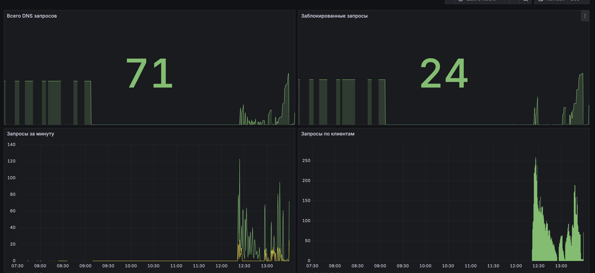
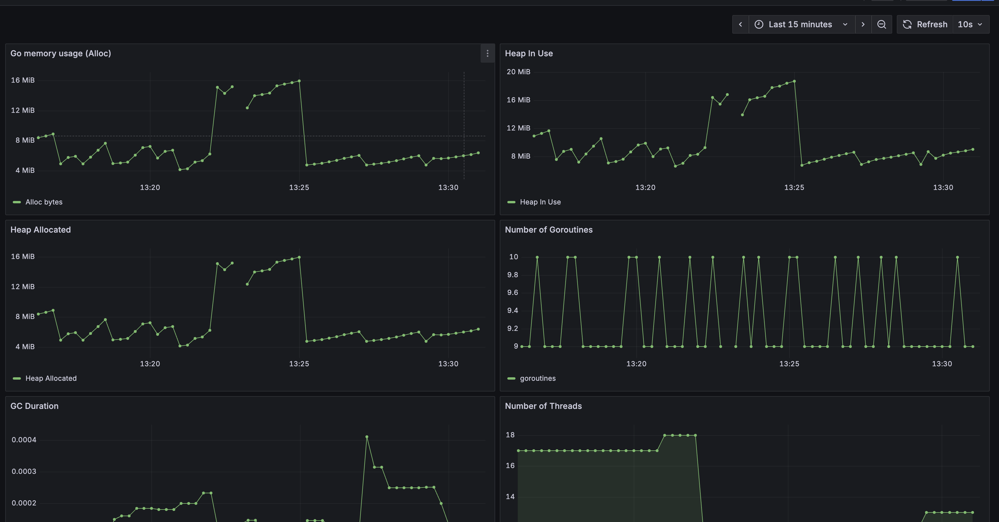

# DNS Filter 🚫🌐

[](https://golang.org/)
[](https://www.docker.com/)
[](LICENSE)

**DNS Filter** — простой и быстрый DNS-блокировщик рекламы на Go. Перенаправляет запросы к нежелательным доменам на недоступный IP, блокируя рекламу на уровне сети.

---

## 🔹 Возможности

- Блокировка рекламы и трекеров на уровне DNS
- Поддержка кастомных черных списков доменов
- Кэширование запросов для ускорения работы
- Метрики для Prometheus
- Docker и Docker Compose для быстрого развёртывания

---

## 📸 Демонстрация работы

  
*Пример заблокированных запросов и метрик Prometheus.*

  
*Визуализация метрик в Grafana.*

---

## 📂 Структура проекта

- `black-lists/` — списки блокируемых доменов
- `cache/` — кэширование запросов
- `db/` — база данных
- `filter/` — логика фильтрации
- `logger/` — логирование запросов
- `metric/` — сбор метрик
- `use-cases/` — примеры использования
- `main.go` — основной исполняемый файл
- `docker-compose.yml` — для запуска через Docker
- `prometheus.yml` — для интеграции с Prometheus

---

## ⚡ Быстрый старт

### Локально

```bash
git clone https://github.com/alextorq/dns-filter.git
cd dns-filter
go build -o dns-filter
./dns-filter
