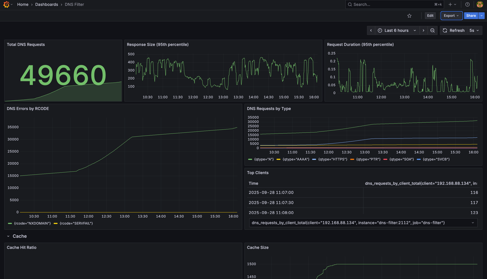

# DNS Filter

it is simple advertisement and malicious site blocking DNS server with web management interface.

[](https://opensource.org/licenses/MIT)
## Features

- DNS filtering with block/allow lists
- Web-based management interface (Vue.js frontend)
- RESTful API (Go backend)
- Event metrics (Prometheus)
- Configurable logging levels
- SQLite database for persistent storage
- Dockerized deployment

## Project Structure

- `main.go` — Entry point for the Go backend
- `black-lists/` — Blocklist management
- `cache/` — DNS cache and metrics
- `config/` — Configuration management
- `db/` — Database connection and migrations
- `dns/` — DNS server logic
- `events/` — Event tracking and web API
- `filter/` — Filtering logic and web API
- `logger/` — Logging (console, Loki)
- `metric/` — Metrics collection
- `use-cases/` — Business logic (block/allow domains, sync, etc.)
- `utils/` — Utility functions
- `web/server.go` — Backend web server
- `web/front/` — Vue.js frontend app
- `Dockerfile.*` — Docker build files
- `prometheus.yml` — Prometheus config
- `nginx.conf` — Nginx config for frontend

## Getting Started

### Prerequisites
- Go 1.20+
- Node.js & npm (for frontend)
- Docker (optional)

### Backend Setup
1. Install Go dependencies:
   ```sh
   go mod tidy
   ```
2. Run the backend server:
   ```sh
   go run main.go
   ```

### Frontend Setup
1. Navigate to the frontend directory:
   ```sh
   cd web/front
   ```
2. Install dependencies:
   ```sh
   npm install
   ```
3. Start the frontend server:
   ```sh
   npm run dev
   ```

### Docker Deployment
1. Build and start all services:
   ```sh
   docker-compose up --build
   ```

## API Overview

- **Change Log Level:** `POST /api/update-log-level`
- **Block/Allow Domain:** `POST /api/block-domain`, `POST /api/allow-domain`
- **Event Listing:** `GET /api/events`
- **DNS Metrics:** `GET /api/metrics`

## Monitoring & Logging
- Prometheus metrics endpoint
- Loki logging integration
- Grafana dashboards in `docs/`




## License

MIT

---
*Generated on September 26, 2025*
