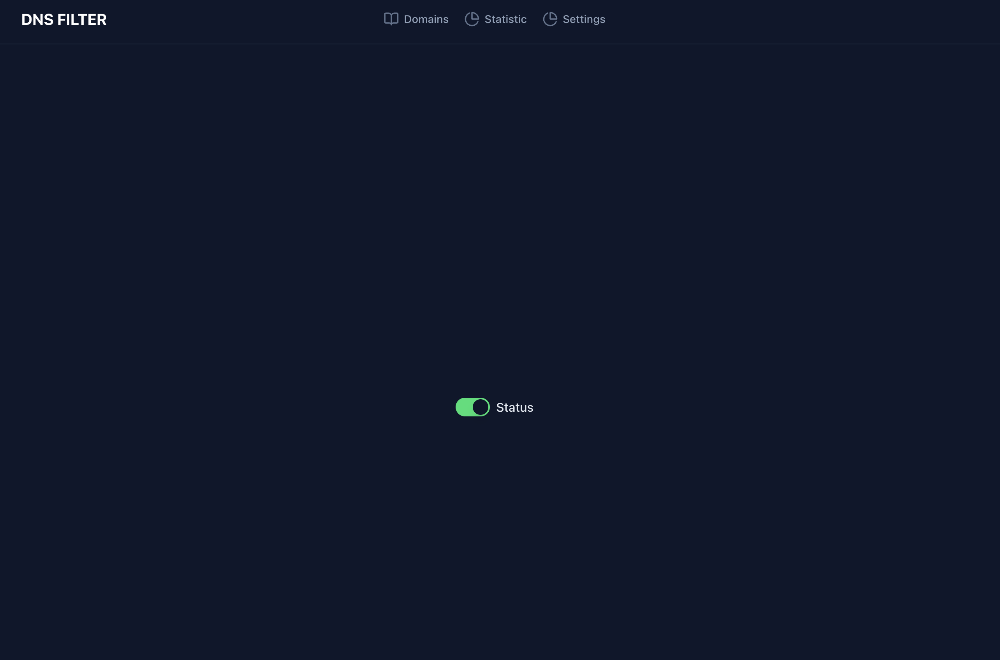
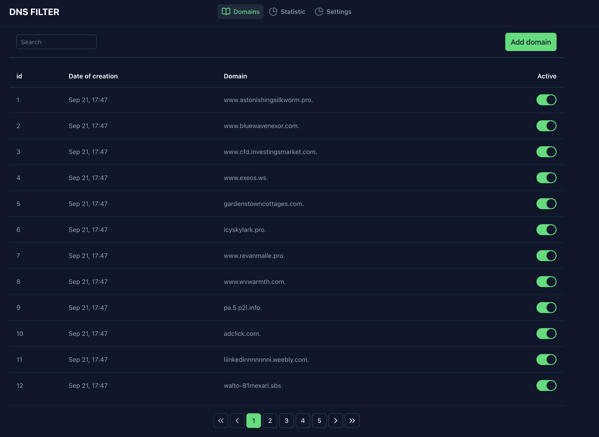

# DNS Filter

it is simple dns service for block advertisement and malicious
you need seed block domains and set it server like dns in your network

[](https://opensource.org/licenses/MIT)
## Features

- DNS filtering with block/allow lists
- Web-based management interface (Vue.js frontend)
- RESTful API (Go backend)
- Event metrics (Prometheus)
- Configurable logging levels
- SQLite database for persistent storage
- Dockerized deployment

## Getting Started

### Prerequisites
- Go 1.20+
- Node.js & npm (for frontend)
- Docker (optional)

### Backend Setup
1. Install Go dependencies:
   ```sh
   go mod tidy
   ```
2. Run the backend server:
   ```sh
   go run main.go
   ```

### Frontend Setup
1. Navigate to the frontend directory:
   ```sh
   cd web/front
   ```
2. Install dependencies:
   ```sh
   npm install
   ```
3. Start the frontend server:
   ```sh
   npm run dev
   ```

### Docker Deployment
1. Build and start all services:
   ```sh
   docker-compose up --build
   ```

## Monitoring & Logging
- Prometheus metrics endpoint
- Loki logging integration
- Grafana dashboards in `docs/`





## License

MIT

---
*Generated on September 26, 2025*
