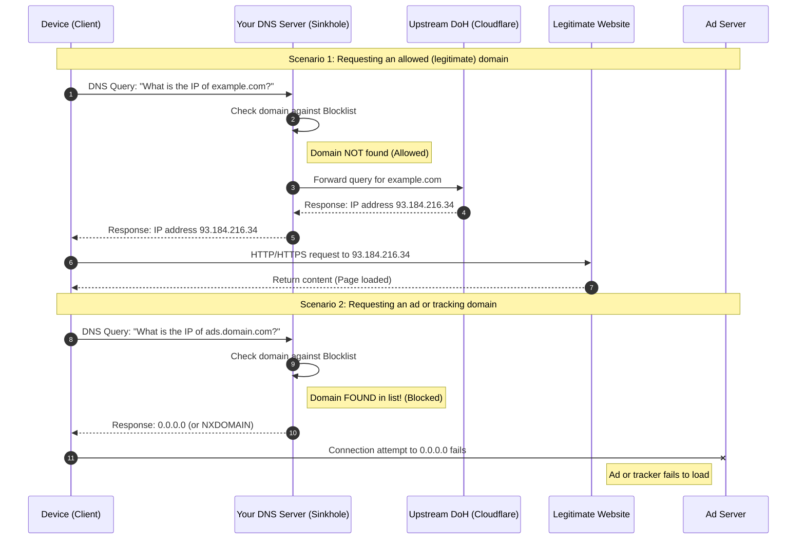
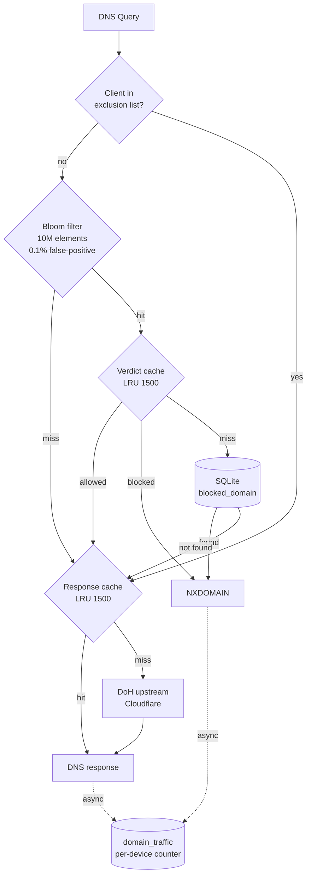

```
██████╗ ███╗   ██╗███████╗      ███████╗██╗██╗  ████████╗███████╗██████╗ 
██╔══██╗████╗  ██║██╔════╝      ██╔════╝██║██║  ╚══██╔══╝██╔════╝██╔══██╗
██║  ██║██╔██╗ ██║███████╗█████╗█████╗  ██║██║     ██║   █████╗  ██████╔╝
██║  ██║██║╚██╗██║╚════██║╚════╝██╔══╝  ██║██║     ██║   ██╔══╝  ██╔══██╗
██████╔╝██║ ╚████║███████║      ██║     ██║███████╗██║   ███████╗██║  ██║
╚═════╝ ╚═╝  ╚═══╝╚══════╝      ╚═╝     ╚═╝╚══════╝╚═╝   ╚══════╝╚═╝  ╚═╝
```

[](https://github.com/alextorq/dns-filter/actions/workflows/test.yml)
[](https://codecov.io/gh/alextorq/dns-filter)
[](https://goreportcard.com/report/github.com/alextorq/dns-filter)
[](https://github.com/alextorq/dns-filter/blob/main/go.mod)
[](https://opensource.org/licenses/MIT)
[](https://github.com/alextorq/dns-filter/commits/main)
[](https://github.com/alextorq/dns-filter/stargazers)

it is simple dns service for block advertisement and malicious
you need seed block domains and set it server like dns in your network



```mermaid
sequenceDiagram
autonumber
participant C as Device (Client)
participant DNS as Your DNS Server (Sinkhole)
participant Upstream as Upstream DoH (Cloudflare)
participant Web as Legitimate Website
participant Ad as Ad Server

    Note over C, Ad: Scenario 1: Requesting an allowed (legitimate) domain
    C->>DNS: DNS Query: "What is the IP of example.com?"
    DNS->>DNS: Check domain against Blocklist
    Note right of DNS: Domain NOT found (Allowed)
    DNS->>Upstream: Forward query for example.com
    Upstream-->>DNS: Response: IP address 93.184.216.34
    DNS-->>C: Response: IP address 93.184.216.34
    C->>Web: HTTP/HTTPS request to 93.184.216.34
    Web-->>C: Return content (Page loaded)

    Note over C, Ad: Scenario 2: Requesting an ad or tracking domain
    C->>DNS: DNS Query: "What is the IP of ads.domain.com?"
    DNS->>DNS: Check domain against Blocklist
    Note right of DNS: Domain FOUND in list! (Blocked)
    DNS-->>C: Response: 0.0.0.0 (or NXDOMAIN)
    C-xAd: Connection attempt to 0.0.0.0 fails
    Note left of Ad: Ad or tracker fails to load
```

## Architecture

The DNS path uses a three-tier check designed to keep the hot path off the database — most queries are answered without ever touching SQLite. Every verdict (blocked or allowed) is recorded asynchronously into the unified per-device `domain_traffic` counter — one row per device + domain + verdict + day — so DB writes never block the DNS reply.


```mermaid
flowchart TD
    Q[DNS Query] --> CK{Client in<br/>exclusion list?}
    CK -->|no| BF{Bloom filter<br/>10M elements<br/>0.1% false-positive}
    BF -->|miss| DC{Response cache<br/>LRU 1500}
    CK -->|yes| DC
    BF -->|hit| LRU{Verdict cache<br/>LRU 1500}
    LRU -->|allowed| DC
    LRU -->|blocked| NX[NXDOMAIN]
    LRU -->|miss| DB[(SQLite<br/>blocked_domain)]
    DB -->|found| NX
    DB -->|not found| DC
    DC -->|hit| RESP[DNS response]
    DC -->|miss| DOH[DoH upstream<br/>Cloudflare]
    DOH --> RESP
    NX -. async .-> TR[(domain_traffic<br/>per-device counter)]
    RESP -. async .-> TR
```

## Features

- DNS filtering with block lists
- DNS-over-HTTPS upstream resolver with singleflight coalescing and
  stale-while-revalidate caching (RFC 8767) — keeps answering during short
  Cloudflare/DoH blips and absorbs thundering-herd on TTL expiry
- Web-based management interface (Vue.js frontend)
- RESTful API (Go backend)
- Domain inspection: reputation, registration age, certificate transparency,
  VirusTotal, urlscan.io, and Google Safe Browsing — aggregated into a single
  verdict before adding a domain to the block list (`/inspect` page, `GET
  /api/domain/inspect`)
- Suggest-to-block heuristic collector (runs every 12h) — flags suspicious
  allowed domains for review. High-confidence candidates (score ≥ 60, or any
  subdomain-of-already-blocked) are auto-promoted to the block list with
  `Source = AutoBlocked`; the rest go to `suggest_blocks` for manual
  approval via the UI. Auto-promotion can be turned off by toggling the
  `AutoBlocked` source on the Sources page — disabled candidates fall through
  to `suggest_blocks` instead. **Weaker lexical candidates (score 10–29) are
  not surfaced directly; with the opt-in reputation-enrichment worker enabled
  they are queued and checked against VirusTotal / Safe Browsing / domain age,
  and only a confirmed verdict acts on them (malicious → block, suspicious →
  `suggest_blocks`, clean → dropped).** See [ARCHITECTURE.md §11](ARCHITECTURE.md)
  for the scoring rules and the enrichment funnel.
- Traffic dashboard (`/traffic` page) — a single view that merges the old
  Statistic page into the per-device traffic analytics. A headline count-up and
  a verdict filter (**All / Blocked / Allowed**) sit on top, always in view; the
  big number tracks the filter. Below are two tabs sharing that headline:
  **Top domains** (the ranked top-targets list, filtered by the verdict) and
  **Devices** (every device on the LAN: how many DNS queries it made, split by
  **blocked vs allowed** and bucketed by **day**, local-midnight). Devices are
  keyed by their **MAC**, falling back to IP, so a device stays the same row
  across DHCP IP churn. Each device is labelled by the most readable identifier
  available — a **friendly hostname** when one is known, otherwise the **OUI
  vendor**, otherwise its IP (the MAC/IP always stays visible underneath).
  Hostnames are learned in the background by a periodic **mDNS sweep** (LAN mode
  only): devices that announce themselves over mDNS (Apple gear, printers, TVs,
  Chromecast, NAS) get a real name; devices that don't (many Android phones,
  some IoT) fall back to vendor/IP. Clicking a device opens a **side panel** with
  its per-domain breakdown (its own verdict filter + pagination). Read-only,
  backed by the unified `domain_traffic` counter (counts only, no per-query
  rows) via:
  - `GET /api/traffic/devices` — per-device allowed/blocked totals, current IP,
    vendor, hostname and last-seen (optional `from`/`to` day range, `YYYY-MM-DD`);
  - `GET /api/traffic/devices/domains` — the domains a single device queried,
    with summed counts (device picked by `kind`+`value` query params; optional
    `blocked` verdict, `from`/`to`, `limit`/`offset`);
  - `GET /api/traffic/top-domains` — highest-traffic domains across all devices
    (optional `blocked`, `limit`).

  How long counters are retained is the `traffic_retention_days` runtime setting
  (env seed `DNS_FILTER_TRAFFIC_RETENTION_DAYS`, default **30**, range 1..3650),
  editable in the UI without a restart; a single daily prune drops rows older
  than the window.
- Block-total counter — `POST /api/events/block/amount` aggregates
  `SUM(count)` from `domain_traffic` (blocked scope) for the home dashboard's
  headline number; the legacy `block_domain_events`/`allow_domain_events` tables
  were removed. (The former `/amount-by-group` endpoint was dropped — the
  Traffic page's `top-domains` covers grouped-by-domain stats.)
- Persistent runtime settings from the Settings page (`GET/PUT/DELETE
  /api/settings`) — log level, DoH upstream + bootstrap IPs, the cache
  tuning knobs (SWR on/off, stale grace/TTL, refresh concurrency) and the
  traffic retention window can be changed without a restart and **survive
  one**. The value is stored in the DB and overrides the env default once set;
  `DELETE /api/settings/{key}` reverts a setting to env control. Env vars
  remain the seed/default. The filter on/off + pause state also persists, so a
  deliberately disabled or paused filter stays that way across a restart. See
  [ARCHITECTURE.md §12](ARCHITECTURE.md) for the design and the
  static/dynamic/secret classification of every setting.
- Manual DNS-cache flush from the Settings page (`POST /api/dns-cache/clear`) —
  drops every entry in the in-memory response cache, useful after rotating
  upstream records with a long TTL
- SQLite database for persistent storage
- Dockerized deployment

### Optional API keys for domain inspection

The inspect endpoint runs a fan-out of independent checks. Four of them are
always on (no setup); three are gated by third-party API keys and degrade
gracefully — without a key the check returns `status: skipped` and the
aggregated verdict is computed from the remaining signals. **All three are
free** for personal use (Safe Browsing has a non-commercial restriction).

| Env var                        | Service                                            | Free tier            |
| ------------------------------ | -------------------------------------------------- | -------------------- |
| `DNS_FILTER_VT_KEY`            | [VirusTotal](https://www.virustotal.com)           | 4 req/min, 500/day   |
| `DNS_FILTER_URLSCAN_KEY`       | [urlscan.io](https://urlscan.io)                   | ~1000 searches/day   |
| `DNS_FILTER_SAFE_BROWSING_KEY` | [Google Safe Browsing v4](https://developers.google.com/safe-browsing/v4) | Generous, non-commercial only |

Step-by-step signup, scoring rules per provider, troubleshooting, and
verification instructions live in **[docs/inspect-keys.md](docs/inspect-keys.md)**.

Keys live in `.env` (see `.env.example` for the template). The file is
git-ignored, so secrets don't end up in the repo.

### Reputation enrichment of suggestions (opt-in)

By default the suggest collector scores candidates with lexical heuristics only.
A background worker can additionally enrich the **weak** band (score 10–29) with
the reputation checks above (RDAP age + VirusTotal + Safe Browsing). It is **off
by default**: it sends observed domains to third parties (a privacy trade-off)
and only adds value with a VT/SB key configured — it will not even start without
one.

| Env var                                | Default | Meaning                                                       |
| -------------------------------------- | ------- | ------------------------------------------------------------- |
| `DNS_FILTER_SUGGEST_INSPECT_ENABLED`   | `false` | master switch (needs a VT or SB key to take effect)           |
| `DNS_FILTER_SUGGEST_INSPECT_BUDGET`    | `5`     | domains inspected per tick — bounds the VirusTotal quota      |
| `DNS_FILTER_SUGGEST_INSPECT_INTERVAL`  | `1h`    | worker tick period                                            |
| `DNS_FILTER_SUGGEST_INSPECT_CACHE_TTL` | `168h`  | how long a verdict stays fresh before re-inspection           |
| `DNS_FILTER_SUGGEST_INSPECT_PAUSE`     | `20s`   | delay between external calls (stay under VirusTotal's 4/min)  |
| `DNS_FILTER_SUGGEST_INSPECT_BACKOFF`   | `30m`   | retry delay for an undecided/failed domain                    |
| `DNS_FILTER_SUGGEST_INSPECT_MAX_ERRORS`| `3`     | give up (cache "unknown") after this many failures            |

Durations use Go's `time.ParseDuration` format: write `168h`, **not** `7d` —
days are not supported. With the default budget (5) and interval (1h) the worker
makes ~120 VirusTotal lookups/day, well under the free tier's 500/day. Metrics
are exported under `suggest_inspect_*` (decisions by verdict, queue depth,
rate-limits, RDAP cache hits).

## Getting Started

### Prerequisites
- Go 1.20+
- Node.js & npm (for frontend)
- Docker (optional)

### Backend Setup
1. Install Go dependencies:
   ```sh
   go mod tidy
   ```
2. Run the backend server:
   ```sh
   go run main.go
   ```

### Frontend Setup
1. Navigate to the frontend directory:
   ```sh
   cd web/front
   ```
2. Install dependencies:
   ```sh
   npm install
   ```
3. Start the frontend server:
   ```sh
   npm run dev
   ```

### Docker Deployment
1. Build and start all services:
   ```sh
   docker-compose up --build
   ```

## Monitoring & Logging
- Prometheus metrics endpoint (`:2112/metrics`, toggled by `DNS_FILTER_METRIC_ENABLE`):
  DNS/cache counters, Go runtime + process metrics (goroutines, heap, GC, CPU, FDs),
  and database metrics — per-operation query latency (`db_query_duration_seconds`),
  query errors (`db_query_errors_total`), connection-pool stats (`go_sql_*`) and
  SQLite file size.
- Loki logging integration
- Grafana dashboards in `grafana/dashboards/` (provisioned via `grafana/provisioning/`):
  `dns-filter.json` (DNS & cache) and `runtime-db.json` (container runtime & database health).


## License

MIT

---
*Generated on September 26, 2025*
