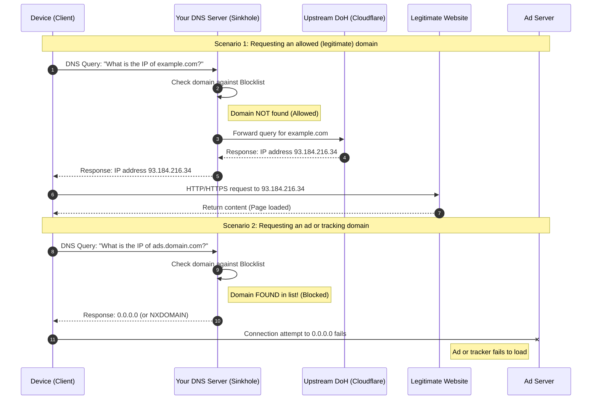
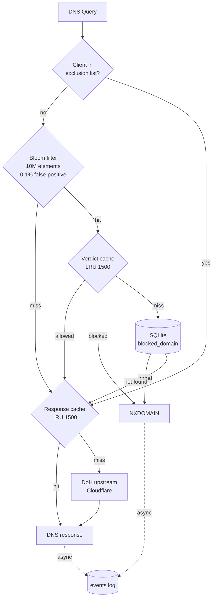

```
██████╗ ███╗   ██╗███████╗      ███████╗██╗██╗  ████████╗███████╗██████╗ 
██╔══██╗████╗  ██║██╔════╝      ██╔════╝██║██║  ╚══██╔══╝██╔════╝██╔══██╗
██║  ██║██╔██╗ ██║███████╗█████╗█████╗  ██║██║     ██║   █████╗  ██████╔╝
██║  ██║██║╚██╗██║╚════██║╚════╝██╔══╝  ██║██║     ██║   ██╔══╝  ██╔══██╗
██████╔╝██║ ╚████║███████║      ██║     ██║███████╗██║   ███████╗██║  ██║
╚═════╝ ╚═╝  ╚═══╝╚══════╝      ╚═╝     ╚═╝╚══════╝╚═╝   ╚══════╝╚═╝  ╚═╝
```

# DNS Filter

[](https://github.com/alextorq/dns-filter/actions/workflows/test.yml)
[](https://codecov.io/gh/alextorq/dns-filter)
[](https://goreportcard.com/report/github.com/alextorq/dns-filter)
[](https://github.com/alextorq/dns-filter/blob/main/go.mod)
[](https://opensource.org/licenses/MIT)
[](https://github.com/alextorq/dns-filter/commits/main)
[](https://github.com/alextorq/dns-filter/stargazers)

it is simple dns service for block advertisement and malicious
you need seed block domains and set it server like dns in your network


```mermaid
sequenceDiagram
autonumber
participant C as Device (Client)
participant DNS as Your DNS Server (Sinkhole)
participant Upstream as Upstream DoH (Cloudflare)
participant Web as Legitimate Website
participant Ad as Ad Server

    Note over C, Ad: Scenario 1: Requesting an allowed (legitimate) domain
    C->>DNS: DNS Query: "What is the IP of example.com?"
    DNS->>DNS: Check domain against Blocklist
    Note right of DNS: Domain NOT found (Allowed)
    DNS->>Upstream: Forward query for example.com
    Upstream-->>DNS: Response: IP address 93.184.216.34
    DNS-->>C: Response: IP address 93.184.216.34
    C->>Web: HTTP/HTTPS request to 93.184.216.34
    Web-->>C: Return content (Page loaded)

    Note over C, Ad: Scenario 2: Requesting an ad or tracking domain
    C->>DNS: DNS Query: "What is the IP of ads.domain.com?"
    DNS->>DNS: Check domain against Blocklist
    Note right of DNS: Domain FOUND in list! (Blocked)
    DNS-->>C: Response: 0.0.0.0 (or NXDOMAIN)
    C-xAd: Connection attempt to 0.0.0.0 fails
    Note left of Ad: Ad or tracker fails to load
```

## Architecture

The DNS path uses a three-tier check designed to keep the hot path off the database — most queries are answered without ever touching SQLite. Block/allow events are emitted asynchronously so DB writes never block the DNS reply.


```mermaid
flowchart TD
    Q[DNS Query] --> CK{Client in<br/>exclusion list?}
    CK -->|no| BF{Bloom filter<br/>10M elements<br/>0.1% false-positive}
    BF -->|miss| DC{Response cache<br/>LRU 1500}
    CK -->|yes| DC
    BF -->|hit| LRU{Verdict cache<br/>LRU 1500}
    LRU -->|allowed| DC
    LRU -->|blocked| NX[NXDOMAIN]
    LRU -->|miss| DB[(SQLite<br/>blocked_domain)]
    DB -->|found| NX
    DB -->|not found| DC
    DC -->|hit| RESP[DNS response]
    DC -->|miss| DOH[DoH upstream<br/>Cloudflare]
    DOH --> RESP
    NX -. async .-> EV[(events log)]
    RESP -. async .-> EV
```

## Features

- DNS filtering with block lists
- DNS-over-HTTPS upstream resolver
- Web-based management interface (Vue.js frontend)
- RESTful API (Go backend)
- Event metrics (Prometheus)
- Configurable logging levels
- SQLite database for persistent storage
- Dockerized deployment

## Getting Started

### Prerequisites
- Go 1.20+
- Node.js & npm (for frontend)
- Docker (optional)

### Backend Setup
1. Install Go dependencies:
   ```sh
   go mod tidy
   ```
2. Run the backend server:
   ```sh
   go run main.go
   ```

### Frontend Setup
1. Navigate to the frontend directory:
   ```sh
   cd web/front
   ```
2. Install dependencies:
   ```sh
   npm install
   ```
3. Start the frontend server:
   ```sh
   npm run dev
   ```

### Docker Deployment
1. Build and start all services:
   ```sh
   docker-compose up --build
   ```

## Monitoring & Logging
- Prometheus metrics endpoint
- Loki logging integration
- Grafana dashboards in `docs/`


## License

MIT

---
*Generated on September 26, 2025*
