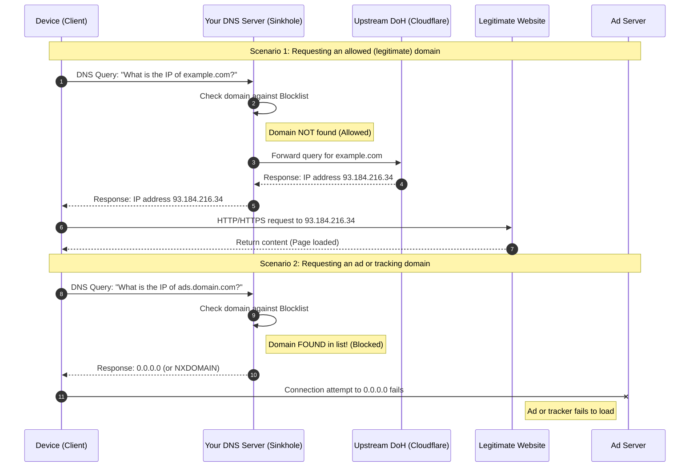
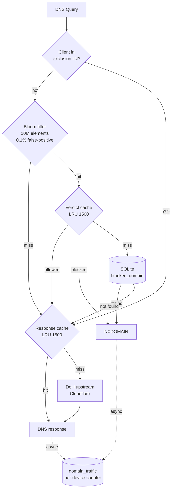

```
██████╗ ███╗   ██╗███████╗      ███████╗██╗██╗  ████████╗███████╗██████╗ 
██╔══██╗████╗  ██║██╔════╝      ██╔════╝██║██║  ╚══██╔══╝██╔════╝██╔══██╗
██║  ██║██╔██╗ ██║███████╗█████╗█████╗  ██║██║     ██║   █████╗  ██████╔╝
██║  ██║██║╚██╗██║╚════██║╚════╝██╔══╝  ██║██║     ██║   ██╔══╝  ██╔══██╗
██████╔╝██║ ╚████║███████║      ██║     ██║███████╗██║   ███████╗██║  ██║
╚═════╝ ╚═╝  ╚═══╝╚══════╝      ╚═╝     ╚═╝╚══════╝╚═╝   ╚══════╝╚═╝  ╚═╝
```

[](https://github.com/alextorq/dns-filter/actions/workflows/test.yml)
[](https://codecov.io/gh/alextorq/dns-filter)
[](https://goreportcard.com/report/github.com/alextorq/dns-filter)
[](https://github.com/alextorq/dns-filter/blob/main/go.mod)
[](https://opensource.org/licenses/MIT)
[](https://github.com/alextorq/dns-filter/commits/main)
[](https://github.com/alextorq/dns-filter/stargazers)

> A self-hosted **sinkhole DNS server** (in the spirit of Pi-hole / AdGuard Home),
> written in Go and shipped with a web management UI. Point your router or your
> devices at it and it filters DNS for your whole network — silently dropping ad,
> tracker, and malware domains while forwarding everything else over an encrypted
> DoH upstream.


## Contents

- [What is it & why](#what-is-it--why)
- [How it works](#how-it-works)
- [Features](#features)
- [Architecture](#architecture)
- [Getting started](#getting-started)
- [Configuration](#configuration)
- [Details & configuration topics](#details--configuration-topics)
  - [Domain inspection & optional API keys](#domain-inspection--optional-api-keys)
  - [Suggest-to-block & reputation enrichment](#suggest-to-block--reputation-enrichment)
  - [Traffic dashboard & retention](#traffic-dashboard--retention)
  - [Persistent runtime settings](#persistent-runtime-settings)
  - [Monitoring & logging](#monitoring--logging)
- [License](#license)

---

## What is it & why

**DNS Filter** is a single Go binary that runs a DNS server on your network and a
web UI to manage it. When a device asks "what is the IP of `ads.example.com`?",
the server checks the domain against block lists. If it's an ad/tracker/malware
domain it answers `NXDOMAIN` (the connection never happens); otherwise it resolves
the name through an upstream **DNS-over-HTTPS** resolver and returns the real
answer.

**Why run it:**

- **Network-wide ad & tracker blocking** — works at the DNS layer, so it covers
  every device that uses it (phones, TVs, IoT) without per-device extensions.
- **Privacy** — upstream resolution goes over encrypted DoH (Cloudflare by
  default), not plaintext port 53.
- **Visibility** — a per-device traffic dashboard shows who queried what, split
  by blocked vs allowed.
- **Lightweight & portable** — one static binary, pure-Go SQLite (no CGO, no C
  toolchain), Docker-ready.

**To use it:** run the server (see [Getting started](#getting-started)), seed the
block lists (done automatically from public sources on first boot), then set its
IP as the DNS server on your router or devices. A short setup walkthrough lives in
[docs/set-up.md](docs/set-up.md).

## How it works


```mermaid
sequenceDiagram
autonumber
participant C as Device (Client)
participant DNS as Your DNS Server (Sinkhole)
participant Upstream as Upstream DoH (Cloudflare)
participant Web as Legitimate Website
participant Ad as Ad Server

    Note over C, Ad: Scenario 1: Requesting an allowed (legitimate) domain
    C->>DNS: DNS Query: "What is the IP of example.com?"
    DNS->>DNS: Check domain against Blocklist
    Note right of DNS: Domain NOT found (Allowed)
    DNS->>Upstream: Forward query for example.com
    Upstream-->>DNS: Response: IP address 93.184.216.34
    DNS-->>C: Response: IP address 93.184.216.34
    C->>Web: HTTP/HTTPS request to 93.184.216.34
    Web-->>C: Return content (Page loaded)

    Note over C, Ad: Scenario 2: Requesting an ad or tracking domain
    C->>DNS: DNS Query: "What is the IP of ads.domain.com?"
    DNS->>DNS: Check domain against Blocklist
    Note right of DNS: Domain FOUND in list! (Blocked)
    DNS-->>C: Response: 0.0.0.0 (or NXDOMAIN)
    C-xAd: Connection attempt to 0.0.0.0 fails
    Note left of Ad: Ad or tracker fails to load
```

## Features

A high-level list — deeper notes for the more involved features are in
[Details & configuration topics](#details--configuration-topics).

- **Block-list filtering** — multi-source block lists (Steven Black, EasyList, …)
  synced into SQLite and checked on a fast three-tier hot path
  ([Architecture](#architecture)).
- **Encrypted DoH upstream** — DNS-over-HTTPS (Cloudflare by default) with
  singleflight coalescing and stale-while-revalidate caching (RFC 8767), so the
  server keeps answering during short upstream blips and absorbs thundering-herd
  on TTL expiry.
- **Web UI + REST API** — a Nuxt 4 / Vue 3 frontend over a Go (Gin) backend.
- **Per-device traffic dashboard** (`/traffic`) — who queried what, blocked vs
  allowed, bucketed by day, with device names learned over mDNS
  ([details](#traffic-dashboard--retention)).
- **Domain inspection** (`/inspect`) — reputation, registration age, certificate
  transparency, VirusTotal, urlscan.io and Google Safe Browsing aggregated into a
  single verdict before you add a domain to the block list
  ([details](#domain-inspection--optional-api-keys)).
- **Suggest-to-block** — a heuristic collector (every 12h) that flags suspicious
  allowed domains; high-confidence candidates are auto-blocked
  ([details](#suggest-to-block--reputation-enrichment)).
- **Persistent runtime settings** (`/settings`) — log level, DoH upstream, cache
  knobs and retention window are editable from the UI and survive a restart
  ([details](#persistent-runtime-settings)).
- **Per-client exclusions** — skip filtering for specific devices by IP.
- **Monitoring** — Prometheus metrics, Grafana dashboards and Loki logging
  ([details](#monitoring--logging)).
- **Single Go binary, SQLite, Docker** — pure Go (no CGO), easy to deploy.

## Architecture

The DNS path uses a **three-tier check** designed to keep the hot path off the
database — most queries are answered without ever touching SQLite. Every verdict
(blocked or allowed) is recorded **asynchronously** into the unified per-device
`domain_traffic` counter — one row per device + domain + verdict + day — so DB
writes never block the DNS reply.


```mermaid
flowchart TD
    Q[DNS Query] --> CK{Client in<br/>exclusion list?}
    CK -->|no| BF{Bloom filter<br/>10M elements<br/>0.1% false-positive}
    BF -->|miss| DC{Response cache<br/>LRU 1500}
    CK -->|yes| DC
    BF -->|hit| LRU{Verdict cache<br/>LRU 1500}
    LRU -->|allowed| DC
    LRU -->|blocked| NX[NXDOMAIN]
    LRU -->|miss| DB[(SQLite<br/>blocked_domain)]
    DB -->|found| NX
    DB -->|not found| DC
    DC -->|hit| RESP[DNS response]
    DC -->|miss| DOH[DoH upstream<br/>Cloudflare]
    DOH --> RESP
    NX -. async .-> TR[(domain_traffic<br/>per-device counter)]
    RESP -. async .-> TR
```

The backend is a single binary that serves DNS on `:53` (UDP + TCP), an HTTP
management API on `:8080`, and optional Prometheus metrics on `:2112`. The
codebase is organised by feature (`dns/`, `filter/`, `blocked-domain/`,
`traffic/`, `clients/`, `source/`, `suggest-to-block/`, `settings/`, `web/`, …).

> 📖 For the full domain model, component diagrams, startup ordering and the
> request flow, see **[ARCHITECTURE.md](ARCHITECTURE.md)**.

## Getting started

### Prerequisites

- **Go 1.25+** (backend)
- **Node.js ≥ 22 & npm** (frontend)
- **Docker** (optional, for the containerised stack)

### Run with Docker (recommended)

The easiest path is the interactive installer — `./deploy.sh`. Anyone can run it:
it checks Docker, offers to free port 53 from `systemd-resolved`, asks for the
admin credentials and any optional reputation API keys, writes a locked-down
`.env`, then builds and starts the stack.

```sh
git clone https://github.com/alextorq/dns-filter.git
cd dns-filter
./deploy.sh            # interactive first-time setup
```

Manage it afterwards: `./deploy.sh update` (pull + rebuild + restart),
`./deploy.sh status`, `./deploy.sh logs`, `./deploy.sh down`.

This builds and starts the backend (DNS + API) and the frontend. See
`docker-compose.yml` — note it uses `network_mode: host` on Linux so the DNS path
sees real client IPs and LAN discovery works.

Prefer to do it by hand? Run `docker compose up --build` directly — but note that
without a `.env` you cannot set the admin login/password and therefore cannot log
into the UI, so copy `.env.example` to `.env` and fill it in first.

### Run locally

**Backend:**

```sh
go mod tidy
go run main.go          # or: air   (hot reload, see .air.toml)
```

**Frontend:**

```sh
cd web/front
npm install
npm run dev
```

## Configuration

All configuration comes from environment variables (loaded from `.env` if
present — copy [`.env.example`](.env.example) to get started). The full list lives
in [`config/config.go`](config/config.go); the load-bearing ones:

| Variable | Default | Description |
| --- | --- | --- |
| `DNS_FILTER_MODE` | `lan` | Deployment profile. `lan` binds `:53` and identifies clients by IP/MAC; `public` is reserved for a future DoH frontend. |
| `DNS_FILTER_DOH_UPSTREAM` | `https://cloudflare-dns.com/dns-query` | Upstream DoH resolver (legacy `DNS_FILTER_UPSTREAM` accepted if it starts with `http(s)://`). |
| `DNS_FILTER_DOH_BOOTSTRAP_IPS` | `1.1.1.1,1.0.0.1` | IPs of the DoH host, so the resolver can bootstrap without system DNS. |
| `DNS_FILTER_DBPATH` | `./filter.sqlite` | SQLite path (`.env` uses `./data/filter.sqlite` to match the Docker volume). |
| `DNS_FILTER_LOG_LEVEL` | — | Log level (also a runtime setting — see below). |
| `DNS_FILTER_METRIC_ENABLE` / `DNS_FILTER_METRIC_PORT` | `false` / `2112` | Prometheus metrics endpoint. |
| `DNS_FILTER_ADMIN_LOGIN` / `DNS_FILTER_ADMIN_PASSWORD` | — | Bootstrap admin, **created on first run only**; change the password in the UI afterwards. |
| `DNS_FILTER_COOKIE_SAMESITE` / `DNS_FILTER_COOKIE_SECURE` | `Lax` / `false` | Auth cookie flags (set `None`/`true` for cross-origin HTTPS). |

Cache tuning (`DNS_FILTER_CACHE_*`), traffic retention
(`DNS_FILTER_TRAFFIC_RETENTION_DAYS`) and the suggest-inspect knobs have sensible
defaults — see [`.env.example`](.env.example) for the complete template. Many of
these double as **persistent runtime settings**: an env var is the seed/default,
and a value set from the UI is stored in the DB and takes precedence
([details](#persistent-runtime-settings)).

## Details & configuration topics

### Domain inspection & optional API keys

The `/inspect` page (`GET /api/domain/inspect`) runs a fan-out of independent
reputation checks and aggregates them into a single verdict before you commit a
domain to the block list. Four checks are always on (no setup); three are gated by
third-party API keys and **degrade gracefully** — without a key the check returns
`status: skipped` and the verdict is computed from the remaining signals. **All
three are free** for personal use (Safe Browsing has a non-commercial
restriction).

| Env var | Service | Free tier |
| --- | --- | --- |
| `DNS_FILTER_VT_KEY` | [VirusTotal](https://www.virustotal.com) | 4 req/min, 500/day |
| `DNS_FILTER_URLSCAN_KEY` | [urlscan.io](https://urlscan.io) | ~1000 searches/day |
| `DNS_FILTER_SAFE_BROWSING_KEY` | [Google Safe Browsing v4](https://developers.google.com/safe-browsing/v4) | Generous, non-commercial only |

Keys live in `.env` (git-ignored, so secrets stay out of the repo). Step-by-step
signup, per-provider scoring rules, troubleshooting and verification instructions
are in **[docs/inspect-keys.md](docs/inspect-keys.md)**.

### Suggest-to-block & reputation enrichment

A background collector runs every 12h and flags suspicious **allowed** domains:

- **High-confidence candidates** (score ≥ 60, or any subdomain of an
  already-blocked domain) are auto-promoted to the block list with
  `Source = AutoBlocked`. Auto-promotion can be disabled by toggling the
  `AutoBlocked` source on the Sources page — disabled candidates fall through to
  `suggest_blocks` for manual approval instead.
- **Medium candidates** land in `suggest_blocks` for manual approval via the UI.
- **Weak lexical candidates** (score 10–29) are not surfaced directly. With the
  opt-in reputation-enrichment worker enabled, they are queued and checked against
  VirusTotal / Safe Browsing / domain age, and only a confirmed verdict acts on
  them (malicious → block, suspicious → `suggest_blocks`, clean → dropped).

The scoring rules and the enrichment funnel are documented in
[ARCHITECTURE.md §11](ARCHITECTURE.md).

**Reputation enrichment is off by default** — it sends observed domains to third
parties (a privacy trade-off) and only adds value with at least one provider key
configured. The master switch and the two provider keys are **DB-backed runtime
settings** (Settings page → "Suggest-to-block · reputation inspect"); the env vars
below are just the initial defaults. Keys are stored as `Type: secret` — the API
masks them to `••••<last 4>` and `/api/config/db/download` strips them from the
exported snapshot.

| Env var / setting key | Default | Meaning |
| --- | --- | --- |
| `DNS_FILTER_SUGGEST_INSPECT_ENABLED` / `suggest_inspect_enabled` | `false` | master switch — works only with at least one provider key set |
| `DNS_FILTER_VT_KEY` / `virustotal_key` | `""` | VirusTotal v3 API key (secret — masked in UI / stripped from db dump) |
| `DNS_FILTER_SAFE_BROWSING_KEY` / `safebrowsing_key` | `""` | Google Safe Browsing v4 API key (secret — see above) |
| `DNS_FILTER_SUGGEST_INSPECT_BUDGET` | `5` | domains inspected per tick — bounds the VirusTotal quota |
| `DNS_FILTER_SUGGEST_INSPECT_INTERVAL` | `1h` | worker tick period |
| `DNS_FILTER_SUGGEST_INSPECT_CACHE_TTL` | `168h` | how long a verdict stays fresh before re-inspection |
| `DNS_FILTER_SUGGEST_INSPECT_PAUSE` | `20s` | delay between external calls (stay under VirusTotal's 4/min) |
| `DNS_FILTER_SUGGEST_INSPECT_BACKOFF` | `30m` | retry delay for an undecided/failed domain |
| `DNS_FILTER_SUGGEST_INSPECT_MAX_ERRORS` | `3` | give up (cache "unknown") after this many failures |

Durations use Go's `time.ParseDuration` format: write `168h`, **not** `7d` — days
are not supported. With the default budget (5) and interval (1h) the worker makes
~120 VirusTotal lookups/day, well under the free tier's 500/day. Metrics are
exported under `suggest_inspect_*` (decisions by verdict, queue depth,
rate-limits, RDAP cache hits).

### Traffic dashboard & retention

The `/traffic` page is a single read-only view backed by the unified
`domain_traffic` counter (counts only, no per-query rows). A headline count-up and
a verdict filter (**All / Blocked / Allowed**) sit on top; below are two tabs:

- **Top domains** — the ranked top-targets list, filtered by the verdict.
- **Devices** — every device on the LAN, with its DNS query counts split by
  **blocked vs allowed** and bucketed by **day** (local-midnight).

Devices are keyed by **MAC** (falling back to IP), so a device stays the same row
across DHCP IP churn, and labelled by the most readable identifier available — a
**friendly hostname** if known, otherwise the **OUI vendor**, otherwise its IP
(MAC/IP always stays visible underneath). Hostnames are learned in the background
by a periodic **mDNS sweep** (LAN mode only): devices that announce over mDNS
(Apple gear, printers, TVs, Chromecast, NAS) get a real name; others fall back to
vendor/IP. Clicking a device opens a **side panel** with its per-domain breakdown.

Endpoints (under the protected group):

- `GET /api/traffic/devices` — per-device allowed/blocked totals, current IP,
  vendor, hostname and last-seen (optional `from`/`to` day range, `YYYY-MM-DD`).
- `GET /api/traffic/devices/domains` — the domains a single device queried, with
  summed counts (device picked by `kind`+`value`; optional `blocked`, `from`/`to`,
  `limit`/`offset`).
- `GET /api/traffic/top-domains` — highest-traffic domains across all devices
  (optional `blocked`, `limit`).
- `POST /api/events/block/amount` — `SUM(count)` over blocked traffic, for the
  home dashboard's headline number.

How long counters are kept is the `traffic_retention_days` runtime setting (env
seed `DNS_FILTER_TRAFFIC_RETENTION_DAYS`, default **30**, range 1..3650), editable
in the UI without a restart; a single daily prune drops rows older than the window.

### Persistent runtime settings

From the Settings page (`GET/PUT/DELETE /api/settings`) you can change the log
level, DoH upstream + bootstrap IPs, the cache tuning knobs (SWR on/off, stale
grace/TTL, refresh concurrency) and the traffic retention window **without a
restart — and they survive one**. Precedence is **DB override → env default**: a
value set from the UI is stored in the DB and overrides the env;
`DELETE /api/settings/{key}` reverts a setting to env control.

The filter on/off + pause state also persists, so a deliberately disabled or
paused filter stays that way across a restart. A manual DNS-cache flush is
available too (`POST /api/dns-cache/clear`), useful after rotating upstream records
with a long TTL.

See [ARCHITECTURE.md §12](ARCHITECTURE.md) for the design and the
static/dynamic/secret classification of every setting.

### Monitoring & logging

- **Prometheus metrics** (`:2112/metrics`, toggled by `DNS_FILTER_METRIC_ENABLE`):
  DNS/cache counters, Go runtime + process metrics (goroutines, heap, GC, CPU,
  FDs), and database metrics — per-operation query latency
  (`db_query_duration_seconds`), query errors (`db_query_errors_total`),
  connection-pool stats (`go_sql_*`) and SQLite file size.
- **Loki** logging integration.
- **Grafana dashboards** in `grafana/dashboards/` (provisioned via
  `grafana/provisioning/`): `dns-filter.json` (DNS & cache) and `runtime-db.json`
  (container runtime & database health).

## License

MIT
